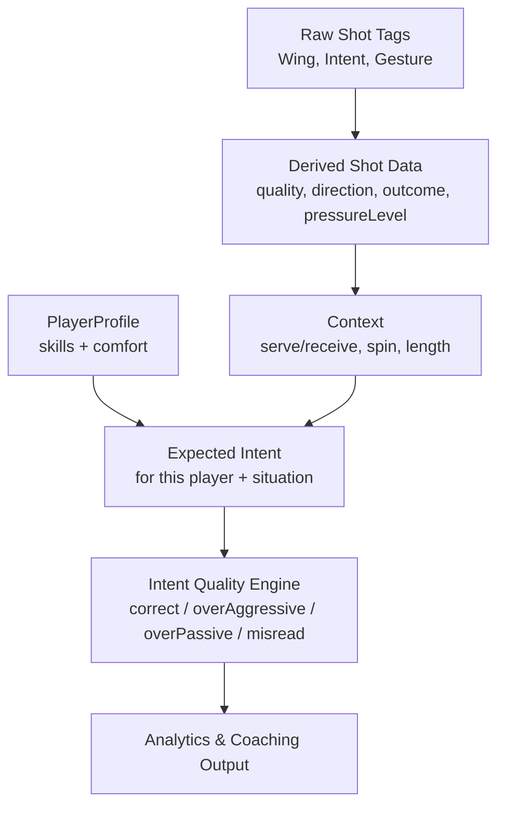

# Player Profile Specification

Filename: `PlayerProfile_Spec.md`  

This document defines the **PlayerProfile** data model for Edge TT Match Analyser and how it integrates with the existing `PLAYERS` table and the shot-level inference engine.

It is intended as a backend + product specification and a reference for any UI work on the player profiling page.

---

## 1. Relationship to Existing `PLAYERS` Table

Current `PLAYERS` schema (simplified from provided specification):

```sql
PLAYERS
-------
uuid                  PK
first_name            NOT NULL
last_name             NOT NULL
date_of_birth         NULL
profile_picture_url   NULL
club_id               NULL  -- lagos | padernense | other
handedness            NOT NULL  -- left | right
playstyle             NOT NULL  -- attack | allround | defence
rubber_forehand       NOT NULL  -- inverted | shortPips | longPips | antiSpin
rubber_backhand       NOT NULL  -- inverted | shortPips | longPips | antiSpin
bio                   NULL
is_archived           DEFAULT false
created_at            DEFAULT NOW()
updated_at            DEFAULT NOW()
``

### 1.1. Design Choice

To avoid bloating the the `PLAYERS` table and to keep skill fields versionable, we introduce a separate table:

```sql
PLAYER_PROFILES
---------------
id                   PK, UUID
player_id            FK -> PLAYERS.uuid  (1:1 recommended)
style                TEXT  -- attacker | allround | defender
handedness           TEXT  -- left | right

-- Absolute skills (0–10, stored as SMALLINT or NUMERIC(3,1))
fh_loop_vs_under     SMALLINT
bh_loop_vs_under     SMALLINT
fh_flick             SMALLINT
bh_flick             SMALLINT
fh_counter_topspin   SMALLINT
bh_counter_topspin   SMALLINT

fh_consistency       SMALLINT
bh_consistency       SMALLINT
receive_consistency  SMALLINT
push_consistency     SMALLINT

vs_under_strength    SMALLINT
vs_top_strength      SMALLINT
vs_nospin_strength   SMALLINT

pivot_comfort        SMALLINT
wide_fh_stability    SMALLINT
wide_bh_stability    SMALLINT
close_table_pref     SMALLINT
far_table_comfort    SMALLINT

-- Level (derived)
coach_estimated_level TEXT  NULL  -- optional; beginner|intermediate|advanced|performance|elite
system_level          TEXT  NOT NULL DEFAULT 'beginner'
system_level_score    NUMERIC(5,2) NOT NULL DEFAULT 0.0  -- 0–100

-- Behaviour over time
decision_bias         TEXT NULL  -- balanced|tooPassive|tooAggressive|spinMisread|overFH|overBH

created_at           timestamptz DEFAULT NOW()
updated_at           timestamptz DEFAULT NOW()
```

> Note: `style` and `handedness` can either:
> - mirror `PLAYERS.playstyle` / `PLAYERS.handedness` for convenience, or  
> - be omitted and read directly from `PLAYERS`.  
> Keeping them here avoids cross-table joins when only profile is loaded, but they must be kept in sync by application logic or DB triggers.

---

## 2. Conceptual Role of PlayerProfile

The PlayerProfile is used by the intent-quality engine to determine:

- Whether a chosen **intent** (def/neutral/agg) was **correct**, **over-aggressive**, or **too passive** for this player.
- What training suggestions should be prioritised (e.g. FH loop vs under, BH flick, wide FH stability).
- How to **derive a system skill level** (`system_level` and `system_level_score`) rather than relying on a manually selected level.

High-level flow:



---

## 3. Skills and Scales

All numeric skill fields are **absolute ability measures**, not relative to the player’s level or age.

Internally they are stored as integers from **0 to 10**. The UI should present **descriptive options**, not numbers; the descriptions are mapped to numeric values by the application.

### 3.1. Universal Technical Skill Scale (0–10)

Used for:

- `fh_loop_vs_under`
- `bh_loop_vs_under`
- `fh_flick`
- `bh_flick`
- `fh_counter_topspin`
- `bh_counter_topspin`

**Coach-facing descriptions → internal values:**

| Value | Description (UI label idea) |
|-------|-----------------------------|
| 0 | Cannot do it at all |
| 1 | Very weak – almost always fails |
| 2 | Very inconsistent – works only vs very easy balls |
| 3 | Can do in practice, not in matches yet |
| 4 | Can use in controlled match situations only |
| 5 | Functional but unreliable in matches |
| 6 | Reliable under normal match pressure |
| 7 | Strong and match-stable; clear strength |
| 8 | High-level weapon; regularly creates pressure |
| 9 | Outstanding weapon at club/league level |
| 10 | Elite / signature skill for this player |

The **same scale** is reused for each technical skill, with field-specific tooltips in the UI, e.g. *“FH loop vs long/half-long underspin”*.

---

### 3.2. Consistency Scale (0–10)

Used for:

- `fh_consistency`
- `bh_consistency`
- `receive_consistency`
- `push_consistency`

| Value | Description |
|-------|-------------|
| 0 | Almost never stable – constant errors |
| 1 | Extremely inconsistent – cannot rally |
| 2 | Can rally occasionally vs very easy balls |
| 3 | Stable only in simple practice drills |
| 4 | Short rallies in matches; often breaks down |
| 5 | Medium stability – 4–8 ball rallies in matches |
| 6 | Match-stable under moderate pressure |
| 7 | Very consistent – hard to break down |
| 8 | High consistency – clear reliability strength |
| 9 | Outstanding – rarely makes unforced rally errors |
| 10 | Elite consistency for current age/level |

---

### 3.3. Spin Handling Scale (0–10)

Used for:

- `vs_under_strength`
- `vs_top_strength`
- `vs_nospin_strength`

| Value | Description |
|-------|-------------|
| 0 | Cannot read or handle this spin type at all |
| 1 | Severe difficulty; misreads most balls |
| 2 | Very limited; only succeeds vs very obvious spin |
| 3 | Basic recognition; can handle very simple balls |
| 4 | Developing; needs time and predictable patterns |
| 5 | Functional vs standard club spin with ~50% success |
| 6 | Reliable recognition under normal conditions |
| 7 | Strong vs this spin; comfortable and confident |
| 8 | High-level mastery; handles deceptive serves/rallies |
| 9 | Outstanding; can exploit opponent’s spin patterns |
| 10 | Elite spin handling for level/age |

---

### 3.4. Positional / Footwork Comfort Scale (0–10)

Used for:

- `pivot_comfort`
- `wide_fh_stability`
- `wide_bh_stability`
- `close_table_pref`
- `far_table_comfort`

| Value | Description |
|-------|-------------|
| 0 | Cannot perform or handle this position/movement |
| 1 | Extreme discomfort – almost always loses point |
| 2 | Very weak – can reach but cannot respond effectively |
| 3 | Can reach but only play very passive ball |
| 4 | Occasional stability; often loses initiative |
| 5 | Moderate stability; can play neutral ball from here |
| 6 | Match-stable; can rally from this position |
| 7 | Strong stability; can attack/counter when stretched |
| 8 | High-level comfort; often turns defence into attack |
| 9 | Outstanding; uses this position tactically |
| 10 | Elite movement/stability in this position |

---

## 4. Style and Handedness

From profile perspective:

```ts
style: 'attacker' | 'allround' | 'defender';
handedness: 'right' | 'left';
```

Mapping to existing `PLAYERS.playstyle`:

- `attack`   → `attacker`
- `allround` → `allround`
- `defence`  → `defender`

`handedness` mirrors `PLAYERS.handedness` (left/right).

---

## 5. Derived Level (System-Level Estimation)

### 5.1. Rationale

- **Coaches describe skills**, not levels.  
- The **system** derives a `system_level` based on skills and (optionally) match performance.  
- This keeps level consistent, objective, and updateable over time.

### 5.2. Level Bands

```ts
type SystemLevel =
  | 'beginner'
  | 'intermediate'
  | 'advanced'
  | 'performance'
  | 'elite';
```

### 5.3. Derivation Outline

1. Compute category averages (0–10):

```ts
const tech = avg([
  fh_loop_vs_under,
  bh_loop_vs_under,
  fh_flick,
  bh_flick,
  fh_counter_topspin,
  bh_counter_topspin
]);

const consistency = avg([
  fh_consistency,
  bh_consistency,
  receive_consistency,
  push_consistency
]);

const spin = avg([
  vs_under_strength,
  vs_top_strength,
  vs_nospin_strength
]);

const position = avg([
  pivot_comfort,
  wide_fh_stability,
  wide_bh_stability
]);
```

2. Combine into a **global skill score** (0–10):

```ts
const globalSkillScore =
  0.4 * tech +
  0.3 * consistency +
  0.2 * spin +
  0.1 * position;
```

3. Optionally blend in a **performanceScore** (0–10) based on match stats (ELO, opponent quality, etc):

```ts
const systemLevelScore0to10 =
  0.7 * globalSkillScore +
  0.3 * performanceScore;
```

4. Map to level bands:

```ts
function mapToSystemLevel(score: number): SystemLevel {
  if (score < 3) return 'beginner';       // 0–2.9
  if (score < 6) return 'intermediate';   // 3–5.9
  if (score < 7.5) return 'advanced';     // 6–7.4
  if (score < 9) return 'performance';    // 7.5–8.9
  return 'elite';                         // 9–10
}
```

5. Store in profile:

```ts
system_level_score = systemLevelScore0to10 * 10; // 0–100
system_level = mapToSystemLevel(systemLevelScore0to10);
```

`coach_estimated_level` is optional and used only for comparison / debugging.

---

## 6. Intent Quality & Decision Bias (Integration Notes)

The PlayerProfile informs the **expected intent** for a given ball. High-level logic:

```ts
function expectedIntentForContext(ctx, profile): 'def' | 'neutral' | 'agg' {
  // Example fragment for long underspin to FH on receive
  if (ctx.phase === 'receive'
    && ctx.incomingSpin === 'under'
    && ctx.length === 'long'
    && ctx.toWing === 'FH') {

    if (profile.fh_loop_vs_under >= 4 && profile.system_level !== 'beginner') {
      return 'agg'; // player is capable → expected to attack
    } else if (profile.fh_loop_vs_under <= 2) {
      return 'neutral'; // pushing is acceptable
    } else {
      return profile.style === 'attacker' ? 'agg' : 'neutral';
    }
  }

  // Additional rules for other patterns...
}
```

Then:

```ts
type IntentQuality =
  | 'correct'
  | 'overAggressive'
  | 'overPassive'
  | 'misread';

function classifyIntentQuality(actualIntent, expectedIntent): IntentQuality {
  if (actualIntent === expectedIntent) return 'correct';

  if (actualIntent === 'agg' && expectedIntent !== 'agg') {
    return 'overAggressive';
  }

  if (actualIntent !== 'agg' && expectedIntent === 'agg') {
    return 'overPassive';
  }

  return 'misread';
}
```

### 6.1. Updating `decision_bias`

Over many rallies, the system aggregates intentQuality and updates:

- `tooPassive` – many overPassive vs few overAggressive.  
- `tooAggressive` – many overAggressive vs few overPassive.  
- `spinMisread` – many misread vs under/no-spin.  
- `overFH` / `overBH` – over-aggression clustered on one wing.

This field is **derived** and never set manually by coaches.

---

## 7. Implementation Notes

- All numeric fields can be stored as `SMALLINT` 0–10 or as `NUMERIC(3,1)` if you later want non-integer steps.
- UI should **never show raw numbers** to coaches; it shows descriptions and internally maps them.
- `PLAYER_PROFILES` can be extended later with new metrics without changing the core logic.
