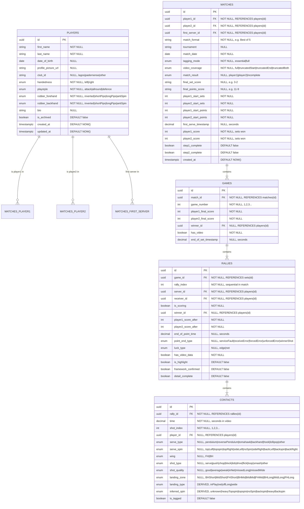

# Edge TT Match Analyser - Database Entity Relationship Diagram

> **Version:** 1.0.0  
> **Date:** 2025-12-02  
> **Status:** Design Document (Pre-Supabase Migration)

---

## Overview

This document defines the complete database schema for the Edge TT Match Analyser application, including the new **Player Profiles** table and relationships between all entities.

---

## Entity Relationship Diagram



---

## Table Descriptions

### **PLAYERS** (Master Data)
**Purpose:** Store player profiles for analysis, scouting, and statistics.

**Key Points:**
- Master data table - players exist independent of matches
- Contains identity, playing characteristics, and equipment
- Supports head-to-head analysis and opponent profiling
- `is_archived` for soft deletes (preserve match history)

**Relationships:**
- One player can be in many matches (as player1, player2, or first server)
- Referenced by `matches.player1_id`, `matches.player2_id`, `matches.first_server_id`
- Referenced by `rallies.server_id`, `rallies.receiver_id`, `rallies.winner_id`
- Referenced by `shots.player_id`

---

### **MATCHES** (Transactional Data)
**Purpose:** Store match-level metadata and configuration.

**Key Points:**
- Links two players via foreign keys
- Contains match outcome and video coverage details
- Tracks workflow state (step1_complete, step2_complete)
- `first_server_id` must be either `player1_id` or `player2_id`

**Relationships:**
- Belongs to two players (player1, player2)
- Has many sets/sets
- Root of the match hierarchy

---

### **GAMES** (Sets)
**Purpose:** Store set-level scores and outcomes.

**Key Points:**
- Each set in a match (Set 1, 2, 3...)
- Final scores for each player
- Winner determined by score comparison
- Links to video timestamps

**Relationships:**
- Belongs to one match
- Has many rallies
- Winner references players table

---

### **RALLIES** (Points)
**Purpose:** Store rally-level outcomes and point details.

**Key Points:**
- Each point in a set
- Tracks server, receiver, winner
- Point end type (how the point ended)
- Cumulative score tracking
- Workflow flags (framework_confirmed, detail_complete)

**Relationships:**
- Belongs to one game
- Has many shots (shots)
- Server, receiver, winner reference players table

---

### **CONTACTS** (Shots/Ball Contacts)
**Purpose:** Store individual shot data within rallies.

**Key Points:**
- Each ball shot in a rally
- Shot index (1=serve, 2=return, 3+...)
- Serve-specific fields (serveType, serveSpin) for shot_index=1
- Rally shot fields (wing, shotType) for shot_index>1
- Derived fields (landingType, inferredSpin) calculated from other fields

**Relationships:**
- Belongs to one rally
- Player references players table
- Sequential within rally (shot_index)

---

## Derived Fields

### Contacts Table

| Field | Derivation | Source Fields |
|-------|------------|---------------|
| `landing_type` | `deriveLandingType(shot_quality)` | `shot_quality` |
| `inferred_spin` | `deriveInferredSpin(shot_type)` | `shot_type` |

### Rallies Table

| Field | Derivation | Source Fields |
|-------|------------|---------------|
| `winner_id` | `deriveEndOfPoint()` | Last shot: `player_id`, `shot_quality` |
| `point_end_type` | `deriveEndOfPoint()` | Last shot: `shot_index`, `shot_quality`, user input |
| `receiver_id` | `otherPlayer(server_id)` | `server_id` |
| `player1_score_after` | Accumulation | Previous rally scores + current `winner_id` |
| `player2_score_after` | Accumulation | Previous rally scores + current `winner_id` |

### Games Table

| Field | Derivation | Source Fields |
|-------|------------|---------------|
| `winner_id` | Score comparison | `player1_final_score` vs `player2_final_score` |

### Matches Table

| Field | Derivation | Source Fields |
|-------|------------|---------------|
| `player1_score` | Count sets won | Games where `winner_id = player1_id` |
| `player2_score` | Count sets won | Games where `winner_id = player2_id` |

---

## Enums and Types

### Handedness
```
'left' | 'right'
```

### Playstyle
```
'attack' | 'allround' | 'defence'
```

### RubberType
```
'inverted' | 'shortPips' | 'longPips' | 'antiSpin'
```

### TaggingMode
```
'essential' | 'full'
```

### VideoCoverage
```
'full' | 'truncatedStart' | 'truncatedEnd' | 'truncatedBoth'
```

### MatchResult
```
'player1' | 'player2' | 'incomplete'
```

### PointEndType
```
'serviceFault' | 'receiveError' | 'forcedError' | 'unforcedError' | 'winnerShot'
```

### LuckType
```
'edge' | 'net'
```

### ServeType
```
'pendulum' | 'reversePendulum' | 'tomahawk' | 'backhand' | 'hook' | 'lollipop' | 'other'
```

### ServeSpin
```
'topLeft' | 'topspin' | 'topRight' | 'sideLeft' | 'noSpin' | 'sideRight' | 'backLeft' | 'backspin' | 'backRight'
```

### Wing
```
'FH' | 'BH'
```

### ShotType (Essential Mode)
```
'serve' | 'push' | 'chop' | 'block' | 'lob' | 'drive' | 'flick' | 'loop' | 'smash' | 'other'
```

### ShotType (Full Mode) - Future
```
'serve' | 'lob' | 'chop' | 'chopBlock' | 'dropShot' | 'shortTouch' | 'push' | 'block' | 'drive' | 'flick' | 'slowSpinLoop' | 'loop' | 'fastLoop' | 'smash' | 'other'
```

### ShotQuality
```
'good' | 'average' | 'weak' | 'inNet' | 'missedLong' | 'missedWide'
```

### LandingZone
```
'BHShort' | 'MidShort' | 'FHShort' | 'BHMid' | 'MidMid' | 'FHMid' | 'BHLong' | 'MidLong' | 'FHLong'
```

### LandingType (Derived)
```
'inPlay' | 'net' | 'offLong' | 'wide'
```

### InferredSpin (Derived)
```
'unknown' | 'heavyTopspin' | 'topspin' | 'noSpin' | 'backspin' | 'heavyBackspin'
```

---

## Indexes (Recommended)

### Players Table
```sql
CREATE INDEX idx_players_name ON players (last_name, first_name);
CREATE INDEX idx_players_club ON players (club_id);
CREATE INDEX idx_players_archived ON players (is_archived) WHERE is_archived = FALSE;
CREATE INDEX idx_players_search ON players USING gin(
  to_tsvector('english', first_name || ' ' || last_name)
);
```

### Matches Table
```sql
CREATE INDEX idx_matches_player1 ON matches (player1_id);
CREATE INDEX idx_matches_player2 ON matches (player2_id);
CREATE INDEX idx_matches_date ON matches (match_date DESC);
CREATE INDEX idx_matches_players ON matches (player1_id, player2_id);
```

### Games Table
```sql
CREATE INDEX idx_games_match ON sets (match_id);
CREATE INDEX idx_games_winner ON sets (winner_id);
```

### Rallies Table
```sql
CREATE INDEX idx_rallies_game ON rallies (game_id);
CREATE INDEX idx_rallies_server ON rallies (server_id);
CREATE INDEX idx_rallies_winner ON rallies (winner_id);
CREATE INDEX idx_rallies_point_end ON rallies (point_end_type);
```

### Contacts Table
```sql
CREATE INDEX idx_contacts_rally ON shots (rally_id);
CREATE INDEX idx_contacts_player ON shots (player_id);
CREATE INDEX idx_contacts_shot_type ON shots (shot_type);
CREATE INDEX idx_contacts_time ON shots (time);
```

---

## Cardinality Summary

| Relationship                | Type | Description                       |
| --------------------------- | ---- | --------------------------------- |
| Player → Match (as player1) | 1:M  | One player plays in many matches  |
| Player → Match (as player2) | 1:M  | One player plays in many matches  |
| Match → Set                | 1:M  | One match contains many sets      |
| Set → Rally                | 1:M  | One set contains many rallies     |
| Rally → Shot             | 1:M  | One rally contains many shots     |
| Player → Rally (as server)  | 1:M  | One player serves in many rallies |
| Player → Rally (as winner)  | 1:M  | One player wins many rallies      |
| Player → Shot            | 1:M  | One player hits many shots        |

---

## Data Volume Estimates

For a typical **Best of 5 match** (3 sets played):

| Entity   | Count | Example                |
| -------- | ----- | ---------------------- |
| Matches  | 1     | Paul vs Ethan          |
| Games    | 3     | Sets 1, 2, 3           |
| Rallies  | ~60   | 20 rallies per set avg |
| Contacts | ~240  | 4 shots per rally avg  |

**For 100 matches tagged:**
- Players: ~50 unique players
- Matches: 100
- Games: ~300
- Rallies: ~6,000
- Contacts: ~24,000

---

## Migration Path

### Current (v0.9.x) - localStorage
- No Player table (just player1Name, player2Name strings)
- No foreign keys (IDs are strings, not UUIDs)
- All data in single localStorage key

### Phase 1 - Add Player Management (localStorage)
- Add `players: Player[]` to localStorage
- Change matches to use `player1_id`, `player2_id`
- Maintain backward compatibility

### Phase 2 - Supabase Migration
- Create tables in Supabase (PostgreSQL)
- Migrate localStorage data to Supabase
- Implement RLS (Row Level Security) policies
- Real-time subscriptions for multi-user

---

## Future Enhancements

### Additional Tables (Post-MVP)

**CLUBS**
- If clubs become structured entities (not just strings)
- Would reference from players.club_id

**TOURNAMENTS**
- If tournaments need structured data
- Would reference from matches.tournament_id

**MATCH_STATISTICS** (Materialized View)
- Pre-computed statistics per match
- Performance optimization for analytics

**PLAYER_STATISTICS** (Materialized View)
- Aggregated career stats per player
- Updated on match completion

---

## Version History

| Version | Date       | Changes                              |
| ------- | ---------- | ------------------------------------ |
| 1.0.0   | 2025-12-02 | Initial ERD with Player table design |

---

## References

- **Data Schema:** `docs-match-analyser-edge-tt/DataSchema.md`
- **Architecture:** `docs-match-analyser-edge-tt/Architecture.md`
- **Type Definitions:** `app/src/rules/types.ts`

