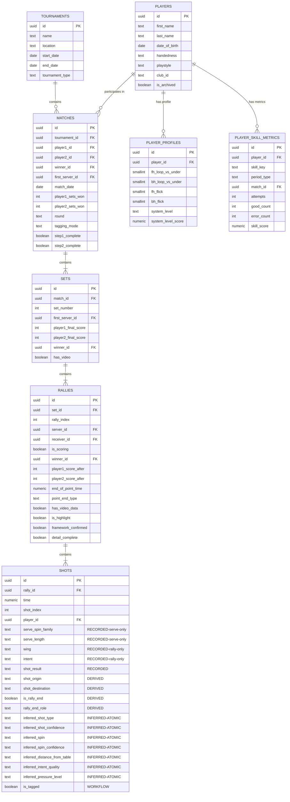

# Database Schema – Prototype V2 Tagging System

> **Version:** 2.0  
> **Date:** 2025-12-05  
> **Status:** Production Schema (fresh implementation, no migration)

---

## Overview

This document defines the **complete database schema** for the Edge TT Match Analyser Prototype V2 tagging system.

**This is a fresh schema** - no migration from v1 needed.

**Key features:**

- **Tournament & match tracking** (competitive context even without video)
- Player profiles with skill tracking (0-10 scales)
- Intent-based shot classification (defensive/neutral/aggressive)
- **Explicit shot origin and destination** for every shot (serves and rallies)
- Serve depth and spin capture
- Inference fields for pressure, intent quality, and shot type
- Player skill metrics for coaching and development tracking
- Support for matches with or without video tagging

---

## Entity Relationship Diagram



---

## Table Definitions

### 1. PLAYERS

Master data table for all players in the system.

```sql
CREATE TABLE players (
  id uuid PRIMARY KEY DEFAULT gen_random_uuid(),
  
  -- Identity
  first_name text NOT NULL,
  last_name text NOT NULL,
  date_of_birth date NULL,
  profile_picture_url text NULL,
  
  -- Playing characteristics
  handedness text NOT NULL CHECK (handedness IN ('left', 'right')),
  playstyle text NOT NULL CHECK (playstyle IN ('attack', 'allround', 'defence')),
  rubber_forehand text NOT NULL CHECK (rubber_forehand IN ('inverted', 'shortPips', 'longPips', 'antiSpin')),
  rubber_backhand text NOT NULL CHECK (rubber_backhand IN ('inverted', 'shortPips', 'longPips', 'antiSpin')),
  
  -- Organization
  club_id text NULL,  -- lagos | padernense | other
  bio text NULL,
  
  -- System
  is_archived boolean NOT NULL DEFAULT false,
  created_at timestamptz NOT NULL DEFAULT now(),
  updated_at timestamptz NOT NULL DEFAULT now()
);

CREATE INDEX idx_players_name ON players (last_name, first_name);
CREATE INDEX idx_players_club ON players (club_id);
CREATE INDEX idx_players_archived ON players (is_archived) WHERE is_archived = false;
```

---

### 2. PLAYER_PROFILES

Skill profiles for coaching and intent quality inference.

```sql
CREATE TABLE player_profiles (
  id uuid PRIMARY KEY DEFAULT gen_random_uuid(),
  player_id uuid NOT NULL REFERENCES players(id) UNIQUE,
  
  -- Technical skills (0-10 scale)
  fh_loop_vs_under smallint CHECK (fh_loop_vs_under BETWEEN 0 AND 10),
  bh_loop_vs_under smallint CHECK (bh_loop_vs_under BETWEEN 0 AND 10),
  fh_flick smallint CHECK (fh_flick BETWEEN 0 AND 10),
  bh_flick smallint CHECK (bh_flick BETWEEN 0 AND 10),
  fh_counter_topspin smallint CHECK (fh_counter_topspin BETWEEN 0 AND 10),
  bh_counter_topspin smallint CHECK (bh_counter_topspin BETWEEN 0 AND 10),
  
  -- Consistency (0-10 scale)
  fh_consistency smallint CHECK (fh_consistency BETWEEN 0 AND 10),
  bh_consistency smallint CHECK (bh_consistency BETWEEN 0 AND 10),
  receive_consistency smallint CHECK (receive_consistency BETWEEN 0 AND 10),
  push_consistency smallint CHECK (push_consistency BETWEEN 0 AND 10),
  
  -- Spin handling (0-10 scale)
  vs_under_strength smallint CHECK (vs_under_strength BETWEEN 0 AND 10),
  vs_top_strength smallint CHECK (vs_top_strength BETWEEN 0 AND 10),
  vs_nospin_strength smallint CHECK (vs_nospin_strength BETWEEN 0 AND 10),
  
  -- Positional comfort (0-10 scale)
  pivot_comfort smallint CHECK (pivot_comfort BETWEEN 0 AND 10),
  wide_fh_stability smallint CHECK (wide_fh_stability BETWEEN 0 AND 10),
  wide_bh_stability smallint CHECK (wide_bh_stability BETWEEN 0 AND 10),
  close_table_pref smallint CHECK (close_table_pref BETWEEN 0 AND 10),
  far_table_comfort smallint CHECK (far_table_comfort BETWEEN 0 AND 10),
  
  -- Derived level
  system_level text NOT NULL DEFAULT 'beginner' 
    CHECK (system_level IN ('beginner', 'intermediate', 'advanced', 'performance', 'elite')),
  system_level_score numeric(5,2) NOT NULL DEFAULT 0.0 CHECK (system_level_score BETWEEN 0 AND 100),
  coach_estimated_level text NULL 
    CHECK (coach_estimated_level IN ('beginner', 'intermediate', 'advanced', 'performance', 'elite')),
  
  -- Behavioral patterns (derived)
  decision_bias text NULL 
    CHECK (decision_bias IN ('balanced', 'tooPassive', 'tooAggressive', 'spinMisread', 'overFH', 'overBH')),
  
  created_at timestamptz NOT NULL DEFAULT now(),
  updated_at timestamptz NOT NULL DEFAULT now()
);

CREATE INDEX idx_player_profiles_player ON player_profiles (player_id);
CREATE INDEX idx_player_profiles_level ON player_profiles (system_level);
```

---

### 3. TOURNAMENTS

Tournament context for competitive matches.

**Purpose:** Track tournament metadata even without video tagging. This enriches player profiles with competitive context and performance history.

**Note:** Not all matches are from tournaments (friendly/club matches exist), so `tournament_id` in MATCHES is nullable.

```sql
CREATE TABLE tournaments (
  id uuid PRIMARY KEY DEFAULT gen_random_uuid(),
  
  name text NOT NULL,
  location text NULL,
  start_date date NOT NULL,
  end_date date NULL,  -- NULL for single-day tournaments
  
  tournament_type text NOT NULL 
    CHECK (tournament_type IN ('friendly', 'club', 'local', 'regional', 'national', 'international')),
  
  notes text NULL,
  
  created_at timestamptz NOT NULL DEFAULT now(),
  updated_at timestamptz NOT NULL DEFAULT now()
);

CREATE INDEX idx_tournaments_date ON tournaments (start_date DESC);
CREATE INDEX idx_tournaments_type ON tournaments (tournament_type);
CREATE INDEX idx_tournaments_name ON tournaments (name);
```

---

### 4. MATCHES

Match-level metadata and workflow state.

**Tournament Integration:** Matches can optionally link to a tournament. This supports:
- **Tournament matches** (competitive context with round info)
- **Friendly/club matches** (no tournament, just players)
- **Result tracking without video** (enter scores for player profiling even if no tagging)

**Use Cases:**
1. Tag match video (full workflow)
2. Enter match results only (no video, but track competitive history)
3. Mix of both within a tournament

```sql
CREATE TABLE matches (
  id uuid PRIMARY KEY DEFAULT gen_random_uuid(),
  
  -- Tournament context (nullable - not all matches are from tournaments)
  tournament_id uuid NULL REFERENCES tournaments(id),
  round text NULL CHECK (round IN ('final', 'semi_final', 'quarter_final', 'round_16', 'round_32', 'groups', 'other')),
  
  -- Players
  player1_id uuid NOT NULL REFERENCES players(id),
  player2_id uuid NOT NULL REFERENCES players(id),
  first_server_id uuid NOT NULL REFERENCES players(id),
  
  -- Match result
  winner_id uuid NULL REFERENCES players(id),
  player1_sets_won int NOT NULL DEFAULT 0,
  player2_sets_won int NOT NULL DEFAULT 0,
  
  -- Match details
  match_format text NOT NULL,  -- e.g. "Best of 5"
  match_date date NOT NULL,
  
  -- Tagging configuration (NULL if match has no video tagging)
  tagging_mode text NULL CHECK (tagging_mode IN ('essential', 'full')),
  video_coverage text NULL 
    CHECK (video_coverage IN ('full', 'truncatedStart', 'truncatedEnd', 'truncatedBoth')),
  
  -- Starting scores (for partial video)
  player1_start_sets int NOT NULL DEFAULT 0,
  player2_start_sets int NOT NULL DEFAULT 0,
  player1_start_points int NOT NULL DEFAULT 0,
  player2_start_points int NOT NULL DEFAULT 0
  
  -- Video
  first_serve_timestamp numeric NULL,  -- seconds
  
  -- Workflow state
  step1_complete boolean NOT NULL DEFAULT false,
  step2_complete boolean NOT NULL DEFAULT false,
  
  created_at timestamptz NOT NULL DEFAULT now(),
  
  CONSTRAINT first_server_is_player CHECK (
    first_server_id = player1_id OR first_server_id = player2_id
  ),
  CONSTRAINT winner_is_player CHECK (
    winner_id IS NULL OR winner_id = player1_id OR winner_id = player2_id
  )
);

CREATE INDEX idx_matches_tournament ON matches (tournament_id);
CREATE INDEX idx_matches_player1 ON matches (player1_id);
CREATE INDEX idx_matches_player2 ON matches (player2_id);
CREATE INDEX idx_matches_winner ON matches (winner_id);
CREATE INDEX idx_matches_date ON matches (match_date DESC);
CREATE INDEX idx_matches_players ON matches (player1_id, player2_id);
CREATE INDEX idx_matches_round ON matches (round) WHERE round IS NOT NULL;
```

---

### 5. SETS

Individual sets within a match.

**Server Tracking:** The `first_server_id` establishes who served first in the set. This is critical for:
- Reconstructing proper serve order when rallies are tagged out of sequence
- Handling real-world scenarios where video timestamps or rally order may be corrected after initial tagging
- Serving as the source of truth for alternating serve calculations

```sql
CREATE TABLE sets (
  id uuid PRIMARY KEY DEFAULT gen_random_uuid(),
  match_id uuid NOT NULL REFERENCES matches(id),
  
  set_number int NOT NULL,  -- 1, 2, 3...
  
  -- Server tracking
  first_server_id uuid NOT NULL REFERENCES players(id),  -- Who served first in this set
  
  -- Final scores
  player1_final_score int NOT NULL,
  player2_final_score int NOT NULL,
  winner_id uuid NULL REFERENCES players(id),
  
  -- Video coverage
  has_video boolean NOT NULL DEFAULT true,
  video_start_player1_score int NULL,  -- for mid-set video starts
  video_start_player2_score int NULL,
  end_of_set_timestamp numeric NULL,  -- seconds
  
  CONSTRAINT sets_match_number_unique UNIQUE (match_id, set_number)
);

CREATE INDEX idx_sets_match ON sets (match_id, set_number);
CREATE INDEX idx_sets_winner ON sets (winner_id);
CREATE INDEX idx_sets_first_server ON sets (first_server_id);
```

---

### 6. RALLIES

Individual points/rallies within a set.

**Server Storage (Not Just Derived):** While `server_id` is theoretically derivable from `first_server_id` + rally alternation rules, we **explicitly store it** because:
- Real-world tagging errors occur (rallies tagged out of order, corrections needed)
- Video may start mid-set with unknown prior serve order
- Manual corrections to serve order should persist
- Queries are much faster with direct storage vs. complex derivation logic
- Source of truth for each rally, regardless of rally_index continuity

**Rally Length Calculation:** The duration of each rally can be computed from:
- `end_of_point_time` (in rallies table) - `MIN(time)` from shots WHERE `rally_id` = rally
- Or: `end_of_point_time` - first shot's timestamp = rally duration in seconds

**Highlight Marking:** The `is_highlight` field allows marking noteworthy rallies for:
- Video export and clip generation
- Coaching review sessions
- Match highlight reels
- Long/complex rally analysis
- Key turning points in matches

```sql
CREATE TABLE rallies (
  id uuid PRIMARY KEY DEFAULT gen_random_uuid(),
  set_id uuid NOT NULL REFERENCES sets(id),
  
  rally_index int NOT NULL,  -- sequential within game
  
  -- Participants
  server_id uuid NOT NULL REFERENCES players(id),
  receiver_id uuid NOT NULL REFERENCES players(id),
  
  -- Outcome
  is_scoring boolean NOT NULL DEFAULT true,
  winner_id uuid NULL REFERENCES players(id),
  
  -- Score tracking
  player1_score_after int NOT NULL,
  player2_score_after int NOT NULL,
  
  -- Rally end details
  end_of_point_time numeric NULL,  -- seconds into video
  point_end_type text NULL 
    CHECK (point_end_type IN ('serviceFault', 'receiveError', 'forcedError', 'unforcedError', 'winnerShot')),
  luck_type text NULL CHECK (luck_type IN ('none', 'luckyNet', 'luckyEdgeTable', 'luckyEdgeBat')),
  opponent_luck_overcome boolean NULL,
  
  -- Video and workflow
  has_video_data boolean NOT NULL DEFAULT true,
  is_highlight boolean NOT NULL DEFAULT false,         -- Mark for video export, coaching review
  framework_confirmed boolean NOT NULL DEFAULT false,  -- Phase 1 complete
  detail_complete boolean NOT NULL DEFAULT false,      -- Phase 2 complete
  
  -- Manual corrections
  server_corrected boolean NOT NULL DEFAULT false,
  score_corrected boolean NOT NULL DEFAULT false,
  correction_notes text NULL,
  
  CONSTRAINT rallies_set_index_unique UNIQUE (set_id, rally_index)
);

CREATE INDEX idx_rallies_set ON rallies (set_id, rally_index);
CREATE INDEX idx_rallies_server ON rallies (server_id);
CREATE INDEX idx_rallies_winner ON rallies (winner_id);
CREATE INDEX idx_rallies_point_end ON rallies (point_end_type);
```

---

### 7. SHOTS

Individual ball contacts within rallies – core tagging data.

**Key insight:** Every shot has an **origin** (where the player hits from) and **destination** (where the ball lands). This applies to both serves and rally shots.

```sql
-- Enums for Tournaments & Matches
CREATE TYPE tournament_type_enum AS ENUM ('friendly', 'club', 'local', 'regional', 'national', 'international');
CREATE TYPE match_round_enum AS ENUM ('final', 'semi_final', 'quarter_final', 'round_16', 'round_32', 'groups', 'other');

-- Enums for Shots & Rallies
CREATE TYPE table_position_enum AS ENUM ('left', 'mid', 'right');
CREATE TYPE shot_intent_enum AS ENUM ('defensive', 'neutral', 'aggressive');
CREATE TYPE shot_result_enum AS ENUM ('good', 'average', 'in_net', 'missed_long');
CREATE TYPE pressure_level_enum AS ENUM ('low', 'medium', 'high');
CREATE TYPE intent_quality_enum AS ENUM ('correct', 'over_aggressive', 'over_passive', 'misread');
CREATE TYPE rally_end_role_enum AS ENUM ('winner', 'forced_error', 'unforced_error', 'none');
CREATE TYPE inferred_confidence_enum AS ENUM ('low', 'medium', 'high');
CREATE TYPE serve_spin_family_enum AS ENUM ('under', 'top', 'no_spin', 'side');
CREATE TYPE serve_length_enum AS ENUM ('short', 'half_long', 'long');

-- Table
CREATE TABLE shots (
  id uuid PRIMARY KEY DEFAULT gen_random_uuid(),
  
  -- ============================================================================
  -- IDENTITY & LINKAGE
  -- ============================================================================
  rally_id uuid NOT NULL REFERENCES rallies(id),
  time numeric NOT NULL,       -- seconds into video
  shot_index int NOT NULL,     -- 1-based (1 = serve, 2 = return, etc.)
  player_id uuid NOT NULL REFERENCES players(id),
  
  -- ============================================================================
  -- RECORDED DATA (direct user input during tagging)
  -- ============================================================================
  
  -- Serve-only fields (shot_index = 1, NULL for rally shots)
  serve_spin_family serve_spin_family_enum NULL,      -- under | top | no_spin | side
  serve_length serve_length_enum NULL,                -- short | half_long | long
  
  -- Rally shot fields (shot_index > 1, NULL for serves)
  wing text NULL CHECK (wing IN ('FH', 'BH')),        -- from stroke (backhand/forehand)
  intent shot_intent_enum NULL,                       -- defensive | neutral | aggressive
  
  -- All shots
  shot_result shot_result_enum NULL,                  -- good | average | in_net | missed_long
  
  -- ============================================================================
  -- DERIVED DATA (deterministically computed from recorded data)
  -- ============================================================================
  
  -- Shot origin and destination (from direction button input)
  shot_origin table_position_enum NOT NULL,           -- left | mid | right (hitter's perspective)
  shot_destination table_position_enum NULL,          -- left | mid | right (receiver's perspective, NULL for errors)
  
  -- Rally structure
  is_rally_end boolean NOT NULL DEFAULT false,        -- true if last shot in rally
  rally_end_role rally_end_role_enum NOT NULL DEFAULT 'none',  -- winner | forced_error | unforced_error | none
  
  -- ============================================================================
  -- INFERRED DATA (atomic building blocks - computed once, used many times)
  -- ============================================================================
  
  -- Shot classification (expensive to compute, core building block)
  inferred_shot_type text NULL,                                -- serve | fh_loop_vs_under | bh_loop_vs_under | fh_flick | bh_flick | 
                                                                -- fh_block | bh_block | fh_counter | bh_counter | push | chop | lob | smash | other | unknown
  inferred_shot_confidence inferred_confidence_enum NULL,
  
  -- Spin on THIS ball (from previous shot type, needed for receive/return analysis)
  inferred_spin text NULL,                                     -- heavy_topspin | topspin | no_spin | backspin | heavy_backspin | side_topspin | side_backspin
  inferred_spin_confidence inferred_confidence_enum NULL,
  
  -- Distance from table (used for shot type classification and positioning analysis)
  inferred_distance_from_table text NULL,                      -- close | mid | far
  
  -- Intent quality vs player profile (expensive: requires player profile lookup)
  inferred_intent_quality intent_quality_enum NULL,            -- correct | over_aggressive | over_passive | misread
  
  -- Pressure level (composite of score, rally length, direction changes)
  inferred_pressure_level pressure_level_enum NULL             -- low | medium | high
  
  -- ============================================================================
  -- WORKFLOW
  -- ============================================================================
  is_tagged boolean NOT NULL DEFAULT false,                    -- true once Phase 2 complete
  
  CONSTRAINT shots_rally_index_unique UNIQUE (rally_id, shot_index)
);

CREATE INDEX idx_shots_rally ON shots (rally_id, shot_index);
CREATE INDEX idx_shots_player ON shots (player_id);
CREATE INDEX idx_shots_result ON shots (shot_result);
CREATE INDEX idx_shots_origin_dest ON shots (shot_origin, shot_destination);
CREATE INDEX idx_shots_inferred_type ON shots (inferred_shot_type);
CREATE INDEX idx_shots_inferred_distance ON shots (inferred_distance_from_table);
CREATE INDEX idx_shots_inferred_spin ON shots (inferred_spin);
CREATE INDEX idx_shots_wing_origin ON shots (wing, shot_origin);  -- for pivot queries
CREATE INDEX idx_shots_time ON shots (time);
```

---

### 8. PLAYER_SKILL_METRICS

Aggregated performance metrics per skill and period.

```sql
CREATE TYPE period_type_enum AS ENUM ('match', 'range');

CREATE TABLE player_skill_metrics (
  id uuid PRIMARY KEY DEFAULT gen_random_uuid(),
  
  player_id uuid NOT NULL REFERENCES players(id),
  skill_key text NOT NULL,  -- e.g. 'fh_loop_vs_under', 'bh_flick', 'serve_short_under_to_bh'
  
  -- Period definition
  period_type period_type_enum NOT NULL,
  match_id uuid NULL REFERENCES matches(id),
  period_start date NULL,
  period_end date NULL,
  
  -- Volume
  total_shots int NOT NULL DEFAULT 0,
  attempts int NOT NULL DEFAULT 0,
  
  -- Basic outcomes
  in_play_count int NOT NULL DEFAULT 0,
  good_count int NOT NULL DEFAULT 0,
  average_count int NOT NULL DEFAULT 0,
  error_count int NOT NULL DEFAULT 0,
  in_net_count int NOT NULL DEFAULT 0,
  missed_long_count int NOT NULL DEFAULT 0,
  
  -- Point outcome influence
  winner_count int NOT NULL DEFAULT 0,
  forced_error_count int NOT NULL DEFAULT 0,
  unforced_error_count int NOT NULL DEFAULT 0,
  
  -- Intent decision quality
  correct_intent_count int NOT NULL DEFAULT 0,
  over_aggressive_count int NOT NULL DEFAULT 0,
  over_passive_count int NOT NULL DEFAULT 0,
  misread_count int NOT NULL DEFAULT 0,
  
  -- Pressure distribution
  low_pressure_count int NOT NULL DEFAULT 0,
  medium_pressure_count int NOT NULL DEFAULT 0,
  high_pressure_count int NOT NULL DEFAULT 0,
  
  -- Derived metrics
  in_play_pct numeric NULL,
  good_pct numeric NULL,
  error_pct numeric NULL,
  winner_pct numeric NULL,
  correct_intent_pct numeric NULL,
  
  -- Aggregate skill score (0-10)
  skill_score numeric NULL,
  skill_score_confidence numeric NULL,
  
  -- Metadata
  model_version text NOT NULL DEFAULT 'v2.0',
  calculated_at timestamptz NOT NULL DEFAULT now()
);

CREATE INDEX idx_player_skill_period ON player_skill_metrics 
  (player_id, skill_key, period_type, match_id, period_start, period_end);
```

---

## Key Field Descriptions

### Shots Table - Data Categories

**RECORDED** (direct user input):
- Serve-only: `serve_spin_family`, `serve_length`
- Rally-only: `wing`, `intent`
- All shots: `shot_result`

**DERIVED** (deterministic computation):
- `shot_origin`, `shot_destination` - extracted from direction button
- `is_rally_end`, `rally_end_role` - computed from rally structure

**INFERRED** (atomic building blocks):
- `inferred_shot_type` + `inferred_shot_confidence`
  - **Note**: Serves are identified as `inferred_shot_type = 'serve'` with `inferred_shot_confidence = 'high'` (100% confidence from `shot_index = 1`)
- `inferred_spin` + `inferred_spin_confidence` - spin on the ball
- `inferred_distance_from_table` - proximity to table
- `inferred_intent_quality` - decision quality vs player profile
- `inferred_pressure_level` - contextual pressure

| Field | Category | Type | Description |
|-------|----------|------|-------------|
| `serve_spin_family` | RECORDED | enum | Serve spin: under/top/no_spin/side (serves only) |
| `serve_length` | RECORDED | enum | Serve depth: short/half_long/long (serves only) |
| `wing` | RECORDED | enum | Wing: FH/BH (rally shots only) |
| `intent` | RECORDED | enum | Intent: defensive/neutral/aggressive (rally shots only) |
| `shot_result` | RECORDED | enum | Quality: good/average/in_net/missed_long |
| `shot_origin` | DERIVED | enum | Where player hits from: left/mid/right |
| `shot_destination` | DERIVED | enum | Where ball lands: left/mid/right (NULL for errors) |
| `is_rally_end` | DERIVED | boolean | True if last shot in rally |
| `rally_end_role` | DERIVED | enum | Shot's role: winner/forced_error/unforced_error/none |
| `inferred_shot_type` | INFERRED | text | Shot classification: serve/fh_loop_vs_under/bh_flick/push/block/etc. |
| `inferred_shot_confidence` | INFERRED | enum | Confidence: low/medium/high (serves always 'high') |
| `inferred_spin` | INFERRED | text | Spin on ball: heavy_topspin/topspin/no_spin/backspin/heavy_backspin |
| `inferred_distance_from_table` | INFERRED | text | Proximity: close/mid/far |
| `inferred_intent_quality` | INFERRED | enum | Decision quality: correct/over_aggressive/over_passive/misread |
| `inferred_pressure_level` | INFERRED | enum | Pressure context: low/medium/high |

### Shot Origin/Destination Logic

**For serves:**
- Direction button pressed: e.g. `left_mid`
  - `shot_origin = 'left'` (where server stands)
  - `shot_destination = 'mid'` (where ball lands on opponent's side)

**For rally shots:**
- Previous shot's `shot_destination` (inverted) becomes current shot's `shot_origin`
- Current direction button: e.g. `right_left`
  - `shot_origin = 'right'` (where hitter is positioned)
  - `shot_destination = 'left'` (where ball lands)

**For errors:**
- `shot_origin` = player's position (from previous shot destination, inverted)
- `shot_destination = NULL` (ball didn't land on opponent's table)

### Inferred Fields

## Stored vs Computed Metrics

### Atomic Inferred Fields (STORE these)

These are **expensive to compute** and serve as **building blocks** for many analyses:

The inference engine computes these once after tagging:

| Field | Inference Logic | Why Store It |
|-------|----------------|--------------|
| `inferred_shot_type` | For serves: `shot_index = 1` → `'serve'`<br>For rallies: serve context + wing/intent + rally flow | 100% confidence for serves; expensive ML/heuristics for rally shots; used in most queries |
| `inferred_spin` | Previous shot type + current shot context | Needed for receive analysis; chain effect through rally |
| `inferred_distance_from_table` | Intent sequence + shot type + pressure + rally flow | Complex rally-level analysis; affects shot classification |
| `inferred_intent_quality` | Player profile lookup + context matching | Requires external profile data; coaching metric |
| `inferred_pressure_level` | Score + rally length + direction changes + positioning | Composite of multiple factors; used for filtering |

### Composite Metrics (COMPUTE on-demand)

These are **fast aggregations** or **combinations** of stored fields:

| Dashboard Metric | SQL Query Logic | Notes |
|------------------|----------------|-------|
| **Pivot Frequency** | `COUNT WHERE wing='FH' AND shot_origin='left'` (right-hander) | Simple filter on stored fields |
| **Pivot Attack Rate** | `COUNT WHERE wing='FH' AND shot_origin='left' AND intent='aggressive'` | Add intent filter |
| **Pivot vs BH Attack** | `SUM(CASE wing='FH' AND origin='left')` vs `SUM(CASE wing='BH')` with intent filter | Group by comparison |
| **Is Third Ball Attack** | `shot_index=3 AND intent='aggressive' AND inferred_shot_type IN (loop types)` | Computed from stored fields |
| **Is Receive Attack** | `shot_index=2 AND intent='aggressive' AND inferred_shot_type IN (attacking types)` | Computed from stored fields |
| **Player Position** | `CASE WHEN wing='FH' AND shot_origin='left' THEN 'wide_fh'` (with handedness) | Derived in query |
| **Line Winners from Cross-Court Serves** | Complex join: serve destination ≠ shot destination + rally_end_role='winner' | Multi-table query |
| **Wide FH Success Rate** | `AVG(shot_result='good') WHERE wing='FH' AND shot_origin='left'` | Aggregation |
| **Serve Pattern Effectiveness** | Group by `serve_length + serve_spin + shot_destination`, measure next shot outcomes | Multi-shot analysis |

### Decision Criteria

**Store inferred data when:**
- Requires ML/AI model execution
- Needs complex multi-shot or multi-rally context
- Used as a filter/dimension in many queries
- Expensive to recompute (player profile lookups, chain calculations)

**Compute on-demand when:**
- Simple WHERE clause on existing fields
- Aggregation (COUNT, AVG, SUM)
- User-specific filter combinations
- Single-record CASE statements
- Dashboard-specific metrics that combine stored fields

### Inference Examples

**Example 1: Forehand positioning**
```
Shot N-1: shot_destination = 'left' (opponent's left)
Shot N: shot_origin = 'right' (inverted), wing = 'FH', handedness = 'right'
→ inferred_player_position = 'very_wide_fh' (righthander playing FH from right side)
```

**Example 2: Counter loop inference**
```
Shot N-2: intent = 'aggressive', inferred_shot_type = 'fh_loop_vs_under'
Shot N-1: intent = 'aggressive', inferred_shot_type = 'bh_counter'
Shot N: intent = 'aggressive', wing = 'FH'
→ inferred_distance_from_table = 'mid' or 'far'
→ inferred_shot_type = 'fh_counter' (high confidence)
```

**Example 3: Serve identification (100% confidence)**
```
Shot 1: shot_index = 1, serve_length = 'long', serve_spin_family = 'under'
→ inferred_shot_type = 'serve' (determined by shot_index = 1)
→ inferred_shot_confidence = 'high' (100% confidence)
→ inferred_distance_from_table = 'close' (serves always close)
```

**Example 4: Receive attack pattern**
```
Shot 1 (serve): 
  - serve_length = 'long', serve_spin_family = 'under', shot_destination = 'mid'
  - inferred_shot_type = 'serve', inferred_shot_confidence = 'high'

Shot 2 (receive): 
  - wing = 'FH', intent = 'aggressive', shot_origin = 'mid'
  - Previous shot was long under serve → incoming spin = 'backspin'
  - inferred_shot_type = 'fh_loop_vs_under', inferred_shot_confidence = 'high'
```

**Example 5: Spin inference**
```
Shot N-1: inferred_shot_type = 'fh_loop_vs_under', wing = 'FH'
Shot N: inferred_shot_type = 'bh_block', wing = 'BH'
→ inferred_spin = 'heavy_topspin' (from the loop on previous shot)
→ inferred_spin_confidence = 'high'
```

---

## Data Flow

### Phase 1 – Timestamp Tagging

1. User taps **Serve/Shot** for each contact → creates shot records with `time` and `shot_index`
2. User presses **WinningShot**, **InNet**, or **ShotMissed** → creates rally with:
   - `endCondition` (winner/innet/long)
   - Links to shots
3. System derives:
   - `player_id` per shot via `calculateShotPlayer(serverId, shotIndex)`
   - `is_rally_end = true` for last shot

### Phase 2 – Detail Tagging

For each shot:

**Serves (shot_index = 1):**
- Direction button (e.g. `left_mid`) → extracts:
  - `shot_origin = 'left'`
  - `shot_destination = 'mid'`
- Length → stores as `serve_length`
- Spin → stores as `serve_spin_family`

**Regular shots:**
- Stroke (with quality toggle) → stores `wing` and `shot_result`
- Direction button (e.g. `right_left`) → extracts:
  - `shot_origin = 'right'` (derived from previous shot's destination, inverted)
  - `shot_destination = 'left'`
- Intent → stores `intent`

**Error shots:**
- Stroke → stores `wing`
- Intent → stores `intent`
- Error type → determines `rally_end_role` (forced_error/unforced_error)
- `shot_origin` from previous shot (inverted)
- `shot_destination = NULL` (error)

### Inference Engine

After tagging, inference engine computes:
- `pressure_level` from context and result
- `intent_quality` from `intent` + `player_profiles` + context
- `inferred_shot_type` from wing/intent/spin/context
- `inferred_shot_confidence` based on pattern clarity

---

## Implementation Notes

### Fresh Start - No Migration

This is a **clean V2 schema** with no legacy data to migrate. Key design principles:

1. **Explicit origin/destination** - every shot stores where it was hit from and where it landed
2. **Intent-based** - captures player decision-making (defensive/neutral/aggressive)
3. **Inference-ready** - structured for AI/ML analysis and coaching insights
4. **Dashboard-friendly** - optimized for visualization and pattern analysis

### What Makes V2 Different

**Core improvements:**
- `shot_origin` + `shot_destination` replace complex direction codes
- Intent-based tagging enables decision quality analysis
- Player profiles drive personalized coaching insights
- Serve depth/spin capture for serve analysis
- Explicit rally-end roles for outcome tracking

**Data we can now analyze:**

*Raw captured data:*
- Shot placement patterns (origin → destination heat maps)
- Serve patterns (length + spin + placement)
- Intent selection (defensive/neutral/aggressive decisions)
- Shot quality and error rates

*Inferred data:*
- Player positioning and court coverage (wide FH/BH, normal)
- Distance from table during rallies
- Complete shot type classification (loops, flicks, blocks, pushes, etc.)
- Spin on every shot in the rally
- Rally patterns (receive attacks, 3rd ball attacks)
- Intent quality vs player skill level
- Pressure situations and performance
- Technical skill development over time

**Dashboard capabilities enabled:**
- Heat maps: shot placement by player, by shot type, by situation
- Positioning analysis: where players struggle when stretched wide
- Shot sequence analysis: serve → receive → 3rd ball patterns
- Spin transitions: what happens after heavy topspin vs backspin
- Intent quality tracking: decision-making improvement over time
- Skill progression: track specific shot types (e.g. BH flick) across matches

---

## Version History

| Version | Date | Changes |
|---------|------|---------|
| 2.0 | 2025-12-05 | Complete V2 schema for intent-based tagging with inference engine |
| 1.1 | 2025-12-02 | Added player profiles, updated terminology |
| 1.0 | 2025-12-01 | Initial schema design |

---

## References

- **Prototype V2 Flows:** `docs-match-analyser-edge-tt/specs/TaggingPrototypeV2_FlowAndSchemaMapping.md`
- **Inference Engine:** `docs-match-analyser-edge-tt/chat_notes/Final/Final/gestures_Intents_Inference_Engine.md`
- **Player Profiles:** `docs-match-analyser-edge-tt/chat_notes/Final/Final/PlayerProfile_Spec.md`
- **Skill Metrics:** `docs-match-analyser-edge-tt/chat_notes/Final/Final/player_skill_metrics.md`

