# Point Tagging Workflow — Logic Diagrams & Decision Trees

> **Version:** 1.0.0  
> **Date:** 2025-12-01  
> **Purpose:** Comprehensive flow diagrams, decision trees, and data storage mapping for the two-part tagging workflow

This document provides visual representations of the complete point tagging workflow, including all decision points, data storage, and logical edge cases.

---

## Table of Contents

1. [Overall Workflow](#1-overall-workflow)
2. [Part 1: Match Framework Flow](#2-part-1-match-framework-flow)
3. [Part 2: Rally Detail Flow](#3-part-2-rally-detail-flow)
4. [Shot Tagging Decision Tree](#4-shot-tagging-decision-tree)
5. [End-of-Point Derivation Logic](#5-end-of-point-derivation-logic)
6. [Data Storage Mapping](#6-data-storage-mapping)
7. [Logical Problems & Solutions](#7-logical-problems--solutions)

---

## 1. Overall Workflow

### 1.1 High-Level Flow

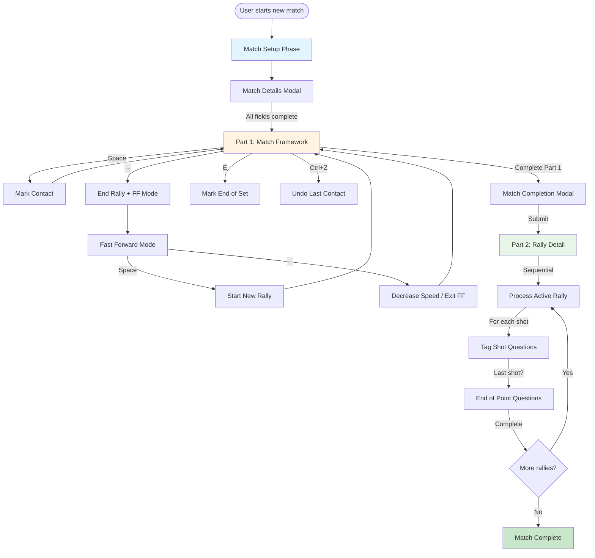
```mermaid
flowchart TD
    Start([User starts new match]) --> Setup[Match Setup Phase]
    Setup --> MatchDetailsModal[Match Details Modal]
    MatchDetailsModal --> |All fields complete| Part1[Part 1: Match Framework]
    
    Part1 --> |Space| MarkContact[Mark Contact]
    Part1 --> |→| EndRally[End Rally + FF Mode]
    Part1 --> |E| MarkEndOfSet[Mark End of Set]
    Part1 --> |Ctrl+Z| UndoContact[Undo Last Contact]
    
    MarkContact --> Part1
    EndRally --> FFMode[Fast Forward Mode]
    FFMode --> |Space| NewRally[Start New Rally]
    FFMode --> |←| SlowDown[Decrease Speed / Exit FF]
    NewRally --> Part1
    SlowDown --> Part1
    
    Part1 --> |Complete Part 1| MatchCompletionModal[Match Completion Modal]
    MatchCompletionModal --> |Submit| Part2[Part 2: Rally Detail]
    
    Part2 --> |Sequential| ProcessRally[Process Active Rally]
    ProcessRally --> |For each shot| TagShot[Tag Shot Questions]
    TagShot --> |Last shot?| EndOfPoint[End of Point Questions]
    EndOfPoint --> |Complete| NextRally{More rallies?}
    NextRally -->|Yes| ProcessRally
    NextRally -->|No| Complete[Match Complete]
    
    style Setup fill:#e1f5ff
    style Part1 fill:#fff4e1
    style Part2 fill:#e8f5e9
    style Complete fill:#c8e6c9
```

### 1.2 Phase Transitions

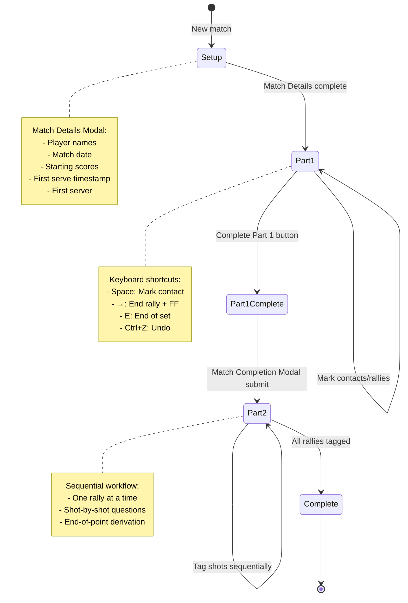
```mermaid
stateDiagram-v2
    [*] --> Setup: New match
    Setup --> Part1: Match Details complete
    Part1 --> Part1: Mark contacts/rallies
    Part1 --> Part1Complete: Complete Part 1 button
    Part1Complete --> Part2: Match Completion Modal submit
    Part2 --> Part2: Tag shots sequentially
    Part2 --> Complete: All rallies tagged
    Complete --> [*]
    
    note right of Setup
        Match Details Modal:
        - Player names
        - Match date
        - Starting scores
        - First serve timestamp
        - First server
    end note
    
    note right of Part1
        Keyboard shortcuts:
        - Space: Mark contact
        - →: End rally + FF
        - E: End of set
        - Ctrl+Z: Undo
    end note
    
    note right of Part2
        Sequential workflow:
        - One rally at a time
        - Shot-by-shot questions
        - End-of-point derivation
    end note
```

---

## 2. Part 1: Match Framework Flow

### 2.1 Contact Marking & Rally Management

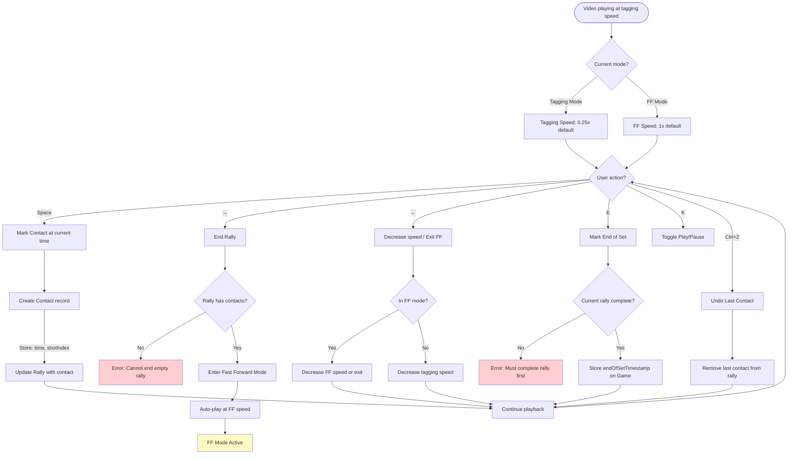
```mermaid
flowchart TD
    Start([Video playing at tagging speed]) --> CheckMode{Current mode?}
    
    CheckMode -->|Tagging Mode| TaggingSpeed[Tagging Speed: 0.25x default]
    CheckMode -->|FF Mode| FFSpeed[FF Speed: 1x default]
    
    TaggingSpeed --> UserInput{User action?}
    FFSpeed --> UserInput
    
    UserInput -->|Space| MarkContact[Mark Contact at current time]
    UserInput -->|→| EndRally[End Rally]
    UserInput -->|←| SlowDown[Decrease speed / Exit FF]
    UserInput -->|E| EndOfSet[Mark End of Set]
    UserInput -->|K| TogglePlay[Toggle Play/Pause]
    UserInput -->|Ctrl+Z| Undo[Undo Last Contact]
    
    MarkContact --> CreateContact[Create Contact record]
    CreateContact --> |Store: time, shotIndex| UpdateRally[Update Rally with contact]
    UpdateRally --> Continue[Continue playback]
    
    EndRally --> CheckContacts{Rally has contacts?}
    CheckContacts -->|No| Error[Error: Cannot end empty rally]
    CheckContacts -->|Yes| EnterFF[Enter Fast Forward Mode]
    EnterFF --> AutoPlay[Auto-play at FF speed]
    AutoPlay --> FFMode[FF Mode Active]
    
    SlowDown --> CheckFF{In FF mode?}
    CheckFF -->|Yes| DecreaseFF[Decrease FF speed or exit]
    CheckFF -->|No| DecreaseTag[Decrease tagging speed]
    DecreaseFF --> Continue
    DecreaseTag --> Continue
    
    EndOfSet --> CheckRallyComplete{Current rally complete?}
    CheckRallyComplete -->|No| Error2[Error: Must complete rally first]
    CheckRallyComplete -->|Yes| StoreEndOfSet[Store endOfSetTimestamp on Game]
    StoreEndOfSet --> Continue
    
    Undo --> RemoveContact[Remove last contact from rally]
    RemoveContact --> Continue
    
    Continue --> UserInput
    
    style FFMode fill:#fff9c4
    style Error fill:#ffcdd2
    style Error2 fill:#ffcdd2
```

### 2.2 Fast Forward Mode Logic

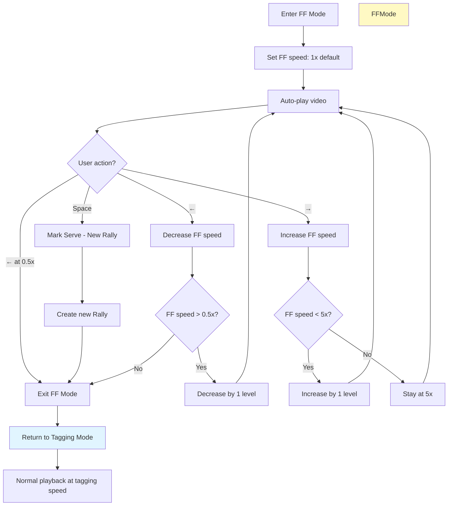
```mermaid
flowchart TD
    EnterFF[Enter FF Mode] --> SetFFSpeed[Set FF speed: 1x default]
    SetFFSpeed --> AutoPlay[Auto-play video]
    AutoPlay --> CheckAction{User action?}
    
    CheckAction -->|Space| MarkServe[Mark Serve - New Rally]
    CheckAction -->|←| SlowFF[Decrease FF speed]
    CheckAction -->|← at 0.5x| ExitFF[Exit FF Mode]
    CheckAction -->|→| IncreaseFF[Increase FF speed]
    
    MarkServe --> CreateRally[Create new Rally]
    CreateRally --> ExitFF
    ExitFF --> TaggingMode[Return to Tagging Mode]
    TaggingMode --> NormalPlayback[Normal playback at tagging speed]
    
    SlowFF --> CheckMinSpeed{FF speed > 0.5x?}
    CheckMinSpeed -->|Yes| DecreaseSpeed[Decrease by 1 level]
    CheckMinSpeed -->|No| ExitFF
    
    IncreaseFF --> CheckMaxSpeed{FF speed < 5x?}
    CheckMaxSpeed -->|Yes| IncreaseSpeed[Increase by 1 level]
    CheckMaxSpeed -->|No| MaxSpeed[Stay at 5x]
    
    DecreaseSpeed --> AutoPlay
    IncreaseSpeed --> AutoPlay
    MaxSpeed --> AutoPlay
    
    style FFMode fill:#fff9c4
    style TaggingMode fill:#e1f5ff
```

### 2.3 Data Stored in Part 1

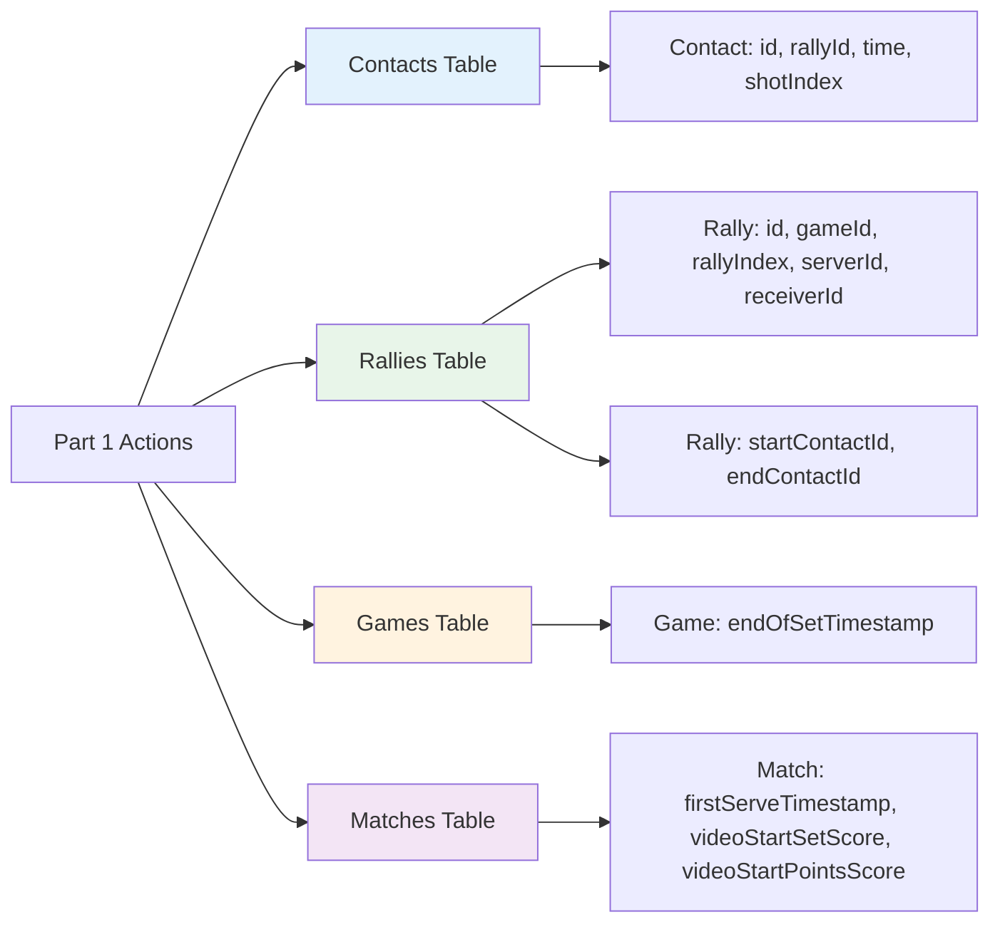
```mermaid
flowchart LR
    Part1[Part 1 Actions] --> Contacts[Contacts Table]
    Part1 --> Rallies[Rallies Table]
    Part1 --> Games[Games Table]
    Part1 --> Match[Matches Table]
    
    Contacts --> C1[Contact: id, rallyId, time, shotIndex]
    Rallies --> R1[Rally: id, gameId, rallyIndex, serverId, receiverId]
    Rallies --> R2[Rally: startContactId, endContactId]
    Games --> G1[Game: endOfSetTimestamp]
    Match --> M1[Match: firstServeTimestamp, videoStartSetScore, videoStartPointsScore]
    
    style Contacts fill:#e3f2fd
    style Rallies fill:#e8f5e9
    style Games fill:#fff3e0
    style Match fill:#f3e5f5
```

---

## 3. Part 2: Rally Detail Flow

### 3.1 Sequential Rally Processing

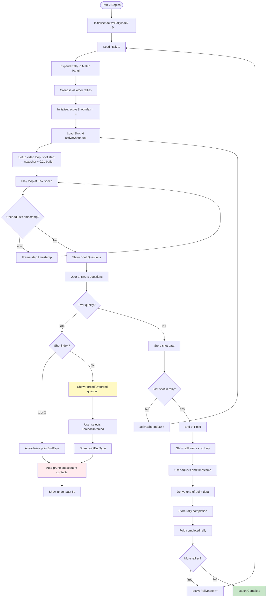
```mermaid
flowchart TD
    StartPart2([Part 2 Begins]) --> InitRally[Initialize: activeRallyIndex = 0]
    InitRally --> LoadRally[Load Rally 1]
    LoadRally --> ExpandRally[Expand Rally in Match Panel]
    ExpandRally --> CollapseOthers[Collapse all other rallies]
    CollapseOthers --> InitShot[Initialize: activeShotIndex = 1]
    
    InitShot --> LoadShot[Load Shot at activeShotIndex]
    LoadShot --> SetupVideo[Setup video loop: shot start → next shot + 0.2s buffer]
    SetupVideo --> PlayLoop[Play loop at 0.5x speed]
    PlayLoop --> UserAdjust{User adjusts timestamp?}
    
    UserAdjust -->|←→| FrameStep[Frame-step timestamp]
    FrameStep --> PlayLoop
    
    UserAdjust -->|No| ShowQuestions[Show Shot Questions]
    ShowQuestions --> AnswerQuestions[User answers questions]
    AnswerQuestions --> CheckError{Error quality?}
    
    CheckError -->|Yes| CheckShotIndex{Shot index?}
    CheckError -->|No| StoreShot[Store shot data]
    
    CheckShotIndex -->|1 or 2| AutoDerive[Auto-derive pointEndType]
    CheckShotIndex -->|3+| ShowForcedUnforced[Show Forced/Unforced question]
    
    AutoDerive --> AutoPrune[Auto-prune subsequent contacts]
    ShowForcedUnforced --> UserSelect[User selects Forced/Unforced]
    UserSelect --> StorePointEnd[Store pointEndType]
    StorePointEnd --> AutoPrune
    
    AutoPrune --> ShowToast[Show undo toast 5s]
    StoreShot --> CheckLastShot{Last shot in rally?}
    
    CheckLastShot -->|No| NextShot[activeShotIndex++]
    NextShot --> LoadShot
    
    CheckLastShot -->|Yes| EndOfPoint[End of Point]
    EndOfPoint --> StillFrame[Show still frame - no loop]
    StillFrame --> AdjustEndTime[User adjusts end timestamp]
    AdjustEndTime --> DeriveEnd[Derive end-of-point data]
    DeriveEnd --> StoreRally[Store rally completion]
    StoreRally --> FoldRally[Fold completed rally]
    FoldRally --> CheckMoreRallies{More rallies?}
    
    CheckMoreRallies -->|Yes| NextRally[activeRallyIndex++]
    NextRally --> LoadRally
    CheckMoreRallies -->|No| Complete[Match Complete]
    
    style ShowForcedUnforced fill:#fff9c4
    style AutoPrune fill:#ffebee
    style Complete fill:#c8e6c9
```

### 3.2 Shot Loop Behavior

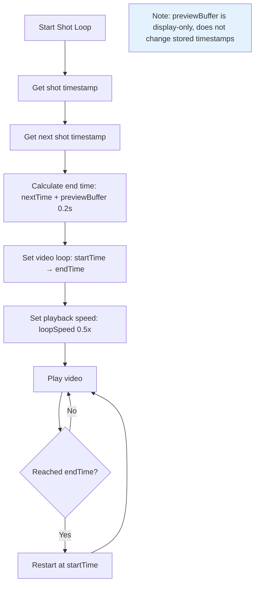
```mermaid
flowchart TD
    StartLoop[Start Shot Loop] --> GetShotTime[Get shot timestamp]
    GetShotTime --> GetNextTime[Get next shot timestamp]
    GetNextTime --> CalculateEnd[Calculate end time: nextTime + previewBuffer 0.2s]
    CalculateEnd --> SetLoop[Set video loop: startTime → endTime]
    SetLoop --> SetSpeed[Set playback speed: loopSpeed 0.5x]
    SetSpeed --> Play[Play video]
    Play --> CheckEnd{Reached endTime?}
    CheckEnd -->|No| Play
    CheckEnd -->|Yes| Restart[Restart at startTime]
    Restart --> Play
    
    note1[Note: previewBuffer is display-only, does not change stored timestamps]
    
    style note1 fill:#e3f2fd
```

---

## 4. Shot Tagging Decision Tree

### 4.1 Essential Mode - Serve (Shot 1)

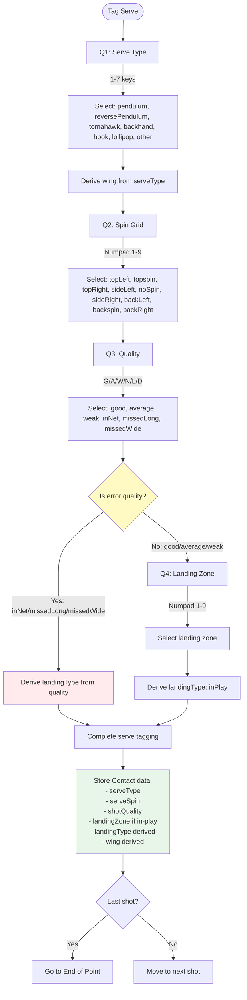
```mermaid
flowchart TD
    StartServe([Tag Serve]) --> Q1[Q1: Serve Type]
    Q1 --> |1-7 keys| SelectType[Select: pendulum, reversePendulum, tomahawk, backhand, hook, lollipop, other]
    SelectType --> DeriveWing[Derive wing from serveType]
    DeriveWing --> Q2[Q2: Spin Grid]
    
    Q2 --> |Numpad 1-9| SelectSpin[Select: topLeft, topspin, topRight, sideLeft, noSpin, sideRight, backLeft, backspin, backRight]
    SelectSpin --> Q3[Q3: Quality]
    
    Q3 --> |G/A/W/N/L/D| SelectQuality[Select: good, average, weak, inNet, missedLong, missedWide]
    SelectQuality --> CheckError{Is error quality?}
    
    CheckError -->|Yes: inNet/missedLong/missedWide| DeriveLanding[Derive landingType from quality]
    CheckError -->|No: good/average/weak| Q4[Q4: Landing Zone]
    
    Q4 --> |Numpad 1-9| SelectLanding[Select landing zone]
    SelectLanding --> DeriveLanding2[Derive landingType: inPlay]
    
    DeriveLanding --> CompleteServe[Complete serve tagging]
    DeriveLanding2 --> CompleteServe
    
    CompleteServe --> StoreData[Store Contact data:<br/>- serveType<br/>- serveSpin<br/>- shotQuality<br/>- landingZone if in-play<br/>- landingType derived<br/>- wing derived]
    
    StoreData --> CheckEndOfPoint{Last shot?}
    CheckEndOfPoint -->|Yes| EndOfPointFlow[Go to End of Point]
    CheckEndOfPoint -->|No| NextShot[Move to next shot]
    
    style CheckError fill:#fff9c4
    style DeriveLanding fill:#ffebee
    style StoreData fill:#e8f5e9
```

### 4.2 Essential Mode - Rally Shot (Shot 2+)

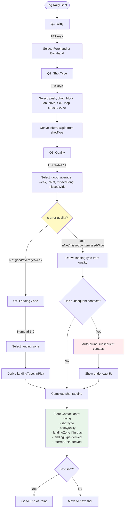
```mermaid
flowchart TD
    StartShot([Tag Rally Shot]) --> Q1[Q1: Wing]
    Q1 --> |F/B keys| SelectWing[Select: Forehand or Backhand]
    SelectWing --> Q2[Q2: Shot Type]
    
    Q2 --> |1-9 keys| SelectShotType[Select: push, chop, block, lob, drive, flick, loop, smash, other]
    SelectShotType --> DeriveSpin[Derive inferredSpin from shotType]
    DeriveSpin --> Q3[Q3: Quality]
    
    Q3 --> |G/A/W/N/L/D| SelectQuality[Select: good, average, weak, inNet, missedLong, missedWide]
    SelectQuality --> CheckError{Is error quality?}
    
    CheckError -->|Yes: inNet/missedLong/missedWide| DeriveLanding[Derive landingType from quality]
    CheckError -->|No: good/average/weak| Q4[Q4: Landing Zone]
    
    Q4 --> |Numpad 1-9| SelectLanding[Select landing zone]
    SelectLanding --> DeriveLanding2[Derive landingType: inPlay]
    
    DeriveLanding --> CheckAutoPrune{Has subsequent contacts?}
    DeriveLanding2 --> CompleteShot[Complete shot tagging]
    
    CheckAutoPrune -->|Yes| AutoPrune[Auto-prune subsequent contacts]
    CheckAutoPrune -->|No| CompleteShot
    
    AutoPrune --> ShowUndoToast[Show undo toast 5s]
    ShowUndoToast --> CompleteShot
    
    CompleteShot --> StoreData[Store Contact data:<br/>- wing<br/>- shotType<br/>- shotQuality<br/>- landingZone if in-play<br/>- landingType derived<br/>- inferredSpin derived]
    
    StoreData --> CheckEndOfPoint{Last shot?}
    CheckEndOfPoint -->|Yes| EndOfPointFlow[Go to End of Point]
    CheckEndOfPoint -->|No| NextShot[Move to next shot]
    
    style CheckError fill:#fff9c4
    style AutoPrune fill:#ffebee
    style StoreData fill:#e8f5e9
```

### 4.3 Question Flow Summary

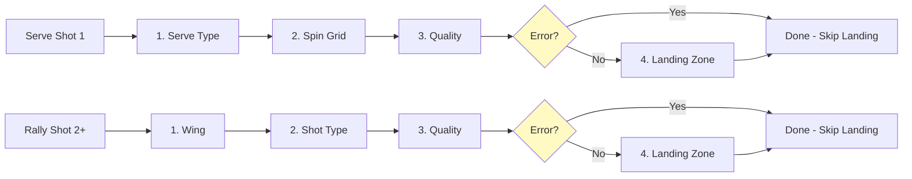
```mermaid
flowchart LR
    Serve[Serve Shot 1] --> S1[1. Serve Type]
    S1 --> S2[2. Spin Grid]
    S2 --> S3[3. Quality]
    S3 --> S4{Error?}
    S4 -->|No| S5[4. Landing Zone]
    S4 -->|Yes| SDone[Done - Skip Landing]
    S5 --> SDone
    
    Rally[Rally Shot 2+] --> R1[1. Wing]
    R1 --> R2[2. Shot Type]
    R2 --> R3[3. Quality]
    R3 --> R4{Error?}
    R4 -->|No| R5[4. Landing Zone]
    R4 -->|Yes| RDone[Done - Skip Landing]
    R5 --> RDone
    
    style S4 fill:#fff9c4
    style R4 fill:#fff9c4
```

---

## 5. End-of-Point Derivation Logic

### 5.1 Complete Decision Tree

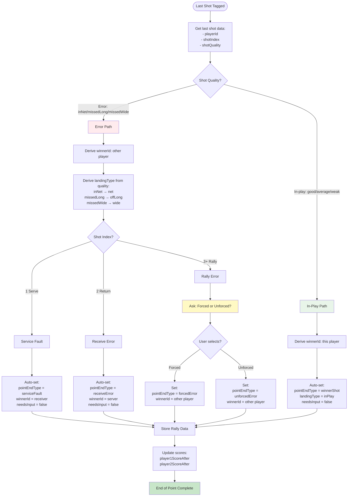
```mermaid
flowchart TD
    Start([Last Shot Tagged]) --> GetLastShot[Get last shot data:<br/>- playerId<br/>- shotIndex<br/>- shotQuality]
    GetLastShot --> CheckQuality{Shot Quality?}
    
    CheckQuality -->|Error: inNet/missedLong/missedWide| ErrorPath[Error Path]
    CheckQuality -->|In-play: good/average/weak| InPlayPath[In-Play Path]
    
    ErrorPath --> DeriveWinner[Derive winnerId: other player]
    DeriveWinner --> DeriveLanding[Derive landingType from quality:<br/>inNet → net<br/>missedLong → offLong<br/>missedWide → wide]
    DeriveLanding --> CheckShotIndex{Shot Index?}
    
    CheckShotIndex -->|1 Serve| ServeError[Service Fault]
    CheckShotIndex -->|2 Return| ReturnError[Receive Error]
    CheckShotIndex -->|3+ Rally| RallyError[Rally Error]
    
    ServeError --> AutoSet1[Auto-set:<br/>pointEndType = serviceFault<br/>winnerId = receiver<br/>needsInput = false]
    ReturnError --> AutoSet2[Auto-set:<br/>pointEndType = receiveError<br/>winnerId = server<br/>needsInput = false]
    RallyError --> AskForcedUnforced[Ask: Forced or Unforced?]
    
    AskForcedUnforced --> UserSelect{User selects?}
    UserSelect -->|Forced| SetForced[Set:<br/>pointEndType = forcedError<br/>winnerId = other player]
    UserSelect -->|Unforced| SetUnforced[Set:<br/>pointEndType = unforcedError<br/>winnerId = other player]
    
    InPlayPath --> DeriveWinner2[Derive winnerId: this player]
    DeriveWinner2 --> AutoSet3[Auto-set:<br/>pointEndType = winnerShot<br/>landingType = inPlay<br/>needsInput = false]
    
    AutoSet1 --> StoreRally[Store Rally Data]
    AutoSet2 --> StoreRally
    SetForced --> StoreRally
    SetUnforced --> StoreRally
    AutoSet3 --> StoreRally
    
    StoreRally --> UpdateScore[Update scores:<br/>player1ScoreAfter<br/>player2ScoreAfter]
    UpdateScore --> Complete[End of Point Complete]
    
    style ErrorPath fill:#ffebee
    style InPlayPath fill:#e8f5e9
    style AskForcedUnforced fill:#fff9c4
    style Complete fill:#c8e6c9
```

### 5.2 Derivation Rules Table

| Last Shot Quality | Shot Index | Derived Winner | Derived pointEndType | User Input Needed |
|-------------------|------------|----------------|----------------------|-------------------|
| `inNet` | 1 (Serve) | Receiver | `serviceFault` | ❌ None |
| `missedLong` | 1 (Serve) | Receiver | `serviceFault` | ❌ None |
| `missedWide` | 1 (Serve) | Receiver | `serviceFault` | ❌ None |
| `inNet` | 2 (Return) | Server | `receiveError` | ❌ None |
| `missedLong` | 2 (Return) | Server | `receiveError` | ❌ None |
| `missedWide` | 2 (Return) | Server | `receiveError` | ❌ None |
| `inNet` | 3+ (Rally) | Other player | — | ✅ Forced/Unforced? |
| `missedLong` | 3+ (Rally) | Other player | — | ✅ Forced/Unforced? |
| `missedWide` | 3+ (Rally) | Other player | — | ✅ Forced/Unforced? |
| `good` | Any | This player | `winnerShot` | ❌ None |
| `average` | Any | This player | `winnerShot` | ❌ None |
| `weak` | Any | This player | `winnerShot` | ❌ None |

### 5.3 Landing Type Derivation

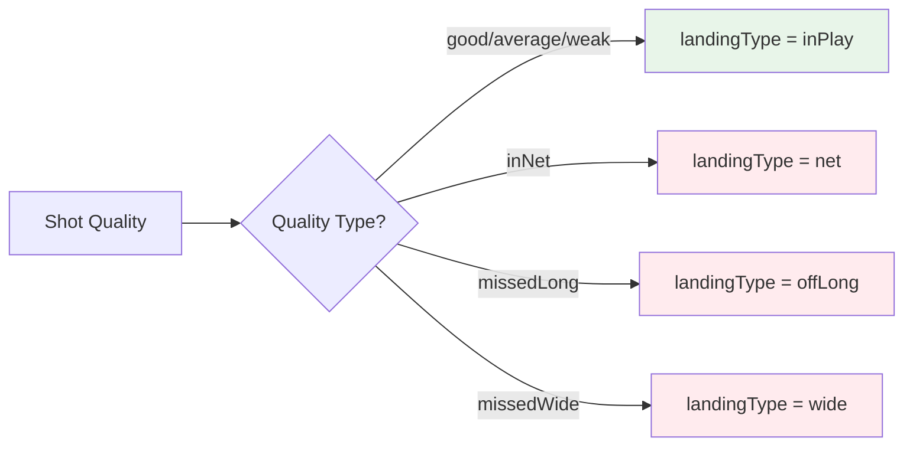
```mermaid
flowchart LR
    Quality[Shot Quality] --> Check{Quality Type?}
    Check -->|good/average/weak| InPlay[landingType = inPlay]
    Check -->|inNet| Net[landingType = net]
    Check -->|missedLong| OffLong[landingType = offLong]
    Check -->|missedWide| Wide[landingType = wide]
    
    style InPlay fill:#e8f5e9
    style Net fill:#ffebee
    style OffLong fill:#ffebee
    style Wide fill:#ffebee
```

---

## 6. Data Storage Mapping

### 6.1 Contact/Shot Data Structure

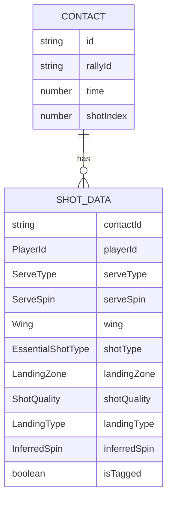
```mermaid
erDiagram
    CONTACT ||--o{ SHOT_DATA : "has"
    CONTACT {
        string id
        string rallyId
        number time
        number shotIndex
    }
    SHOT_DATA {
        string contactId
        PlayerId playerId
        ServeType serveType
        ServeSpin serveSpin
        Wing wing
        EssentialShotType shotType
        LandingZone landingZone
        ShotQuality shotQuality
        LandingType landingType
        InferredSpin inferredSpin
        boolean isTagged
    }
```

### 6.2 Data Flow Through Workflow

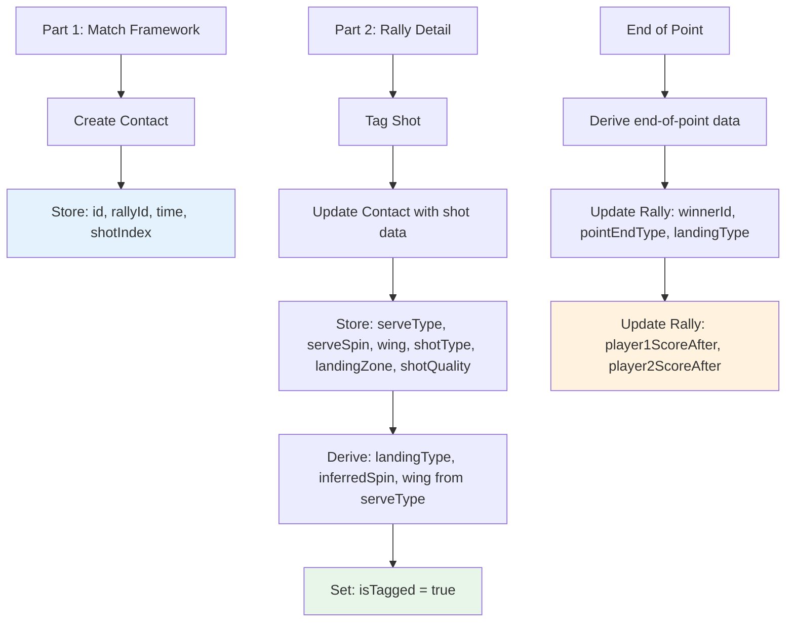
```mermaid
flowchart TD
    Part1[Part 1: Match Framework] --> C1[Create Contact]
    C1 --> C2[Store: id, rallyId, time, shotIndex]
    
    Part2[Part 2: Rally Detail] --> S1[Tag Shot]
    S1 --> S2[Update Contact with shot data]
    S2 --> S3[Store: serveType, serveSpin, wing, shotType, landingZone, shotQuality]
    S3 --> S4[Derive: landingType, inferredSpin, wing from serveType]
    S4 --> S5[Set: isTagged = true]
    
    EndPoint[End of Point] --> E1[Derive end-of-point data]
    E1 --> E2[Update Rally: winnerId, pointEndType, landingType]
    E2 --> E3[Update Rally: player1ScoreAfter, player2ScoreAfter]
    
    style C2 fill:#e3f2fd
    style S5 fill:#e8f5e9
    style E3 fill:#fff3e0
```

### 6.3 Complete Data Storage Map

| Phase | Action | Data Stored | Table/Field |
|-------|--------|-------------|-------------|
| **Setup** | Match Details Modal | Player names, date, scores | `matches.player1Id`, `matches.player2Id`, `matches.matchDate` |
| | | Starting scores | `matches.videoStartSetScore`, `matches.videoStartPointsScore` |
| | | First serve | `matches.firstServeTimestamp`, `matches.firstServerId` |
| **Part 1** | Mark Contact | Contact timestamp | `contacts.time`, `contacts.shotIndex` |
| | End Rally | Rally boundaries | `rallies.startContactId`, `rallies.endContactId` |
| | | Server/Receiver | `rallies.serverId`, `rallies.receiverId` (derived) |
| | End of Set | Set marker | `games.endOfSetTimestamp` |
| **Part 2** | Tag Serve | Serve type | `contacts.serveType` |
| | | Serve spin | `contacts.serveSpin` |
| | | Quality | `contacts.shotQuality` |
| | | Landing zone | `contacts.landingZone` (if in-play) |
| | | Derived wing | `contacts.wing` (from serveType) |
| | Tag Rally Shot | Wing | `contacts.wing` |
| | | Shot type | `contacts.shotType` |
| | | Quality | `contacts.shotQuality` |
| | | Landing zone | `contacts.landingZone` (if in-play) |
| | | Derived spin | `contacts.inferredSpin` (from shotType) |
| | End of Point | Winner | `rallies.winnerId` (derived) |
| | | Point end type | `rallies.pointEndType` (derived/selected) |
| | | Landing type | `rallies.landingType` (derived) |
| | | Scores | `rallies.player1ScoreAfter`, `rallies.player2ScoreAfter` |
| **Completion** | Match Completion | Final result | `matches.matchResult` |
| | | Final scores | `matches.finalSetScore`, `matches.finalPointsScore` |
| | | Video coverage | `matches.videoCoverage` |

---

## 7. Logical Problems & Solutions

### 7.1 Problem: Auto-Prune Timing

**Problem:** When should auto-pruning occur?

**Current Logic:**
- Auto-prune triggers when error quality is selected AND there are subsequent contacts
- Pruning happens immediately after quality selection

**Edge Cases:**
1. User selects error quality, then changes mind → contacts already deleted
2. User wants to keep subsequent contacts (rare but possible)
3. Undo toast expires before user can undo

**Solutions:**

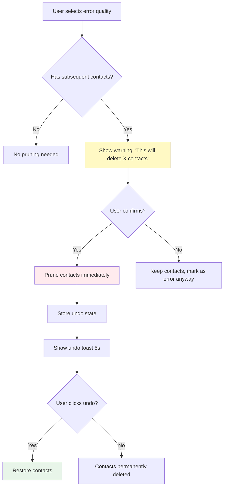
```mermaid
flowchart TD
    SelectError[User selects error quality] --> CheckSubsequent{Has subsequent contacts?}
    CheckSubsequent -->|No| NoPrune[No pruning needed]
    CheckSubsequent -->|Yes| ShowWarning[Show warning: 'This will delete X contacts']
    ShowWarning --> UserConfirm{User confirms?}
    UserConfirm -->|Yes| PruneNow[Prune contacts immediately]
    UserConfirm -->|No| KeepContacts[Keep contacts, mark as error anyway]
    
    PruneNow --> StoreUndo[Store undo state]
    StoreUndo --> ShowToast[Show undo toast 5s]
    ShowToast --> UserUndo{User clicks undo?}
    UserUndo -->|Yes| RestoreContacts[Restore contacts]
    UserUndo -->|No| ContactsDeleted[Contacts permanently deleted]
    
    style ShowWarning fill:#fff9c4
    style PruneNow fill:#ffebee
    style RestoreContacts fill:#e8f5e9
```

**Recommendation:** Add confirmation dialog before auto-pruning, or make it a soft delete (mark as deleted, allow undo).

---

### 7.2 Problem: End-of-Point Derivation for Incomplete Rallies

**Problem:** What if user hasn't tagged all shots in a rally before reaching end-of-point?

**Current Logic:**
- End-of-point is shown when user reaches last contact
- But user might skip shots or have untagged shots

**Edge Cases:**
1. User tags shot 1, skips to end-of-point → missing shot 2 data
2. User tags shot 1, 2, but shot 3 is untagged → can't derive properly
3. Rally has contacts but no shots tagged yet

**Solutions:**

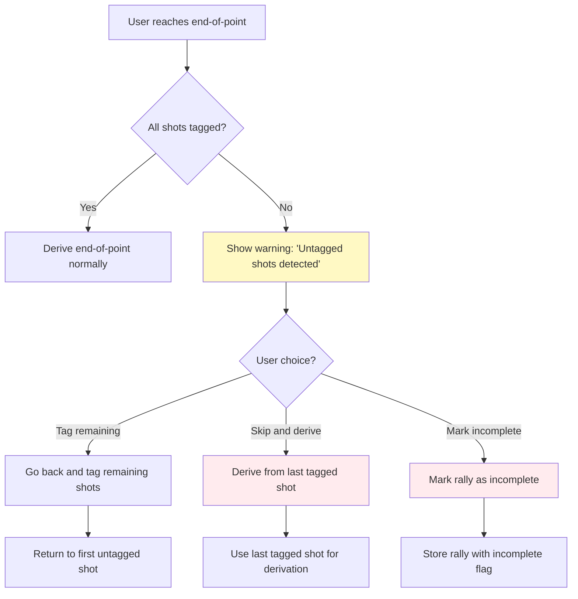
```mermaid
flowchart TD
    ReachedEnd[User reaches end-of-point] --> CheckAllTagged{All shots tagged?}
    CheckAllTagged -->|Yes| DeriveNormally[Derive end-of-point normally]
    CheckAllTagged -->|No| ShowWarning2[Show warning: 'Untagged shots detected']
    ShowWarning2 --> UserChoice{User choice?}
    UserChoice -->|Tag remaining| TagRemaining[Go back and tag remaining shots]
    UserChoice -->|Skip and derive| DerivePartial[Derive from last tagged shot]
    UserChoice -->|Mark incomplete| MarkIncomplete[Mark rally as incomplete]
    
    TagRemaining --> ReturnToShot[Return to first untagged shot]
    DerivePartial --> UseLastTagged[Use last tagged shot for derivation]
    MarkIncomplete --> StoreIncomplete[Store rally with incomplete flag]
    
    style ShowWarning2 fill:#fff9c4
    style DerivePartial fill:#ffebee
    style MarkIncomplete fill:#ffebee
```

**Recommendation:** Enforce sequential tagging - don't allow skipping to end-of-point until all shots are tagged.

---

### 7.3 Problem: Serve Order Calculation at Deuce

**Problem:** Serve order calculation becomes complex at deuce (10-10).

**Current Logic:**
```typescript
// At deuce: alternate every serve
if (p1Score >= 10 && p2Score >= 10) {
  return totalPoints % 2 === 0 ? firstServer : otherPlayer(firstServer)
}
```

**Edge Cases:**
1. What if score reaches 10-10, then goes to 11-10? Still deuce?
2. What if score goes 10-10 → 10-11 → 11-11? Still deuce?
3. How to calculate backwards from current server at deuce?

**Solutions:**

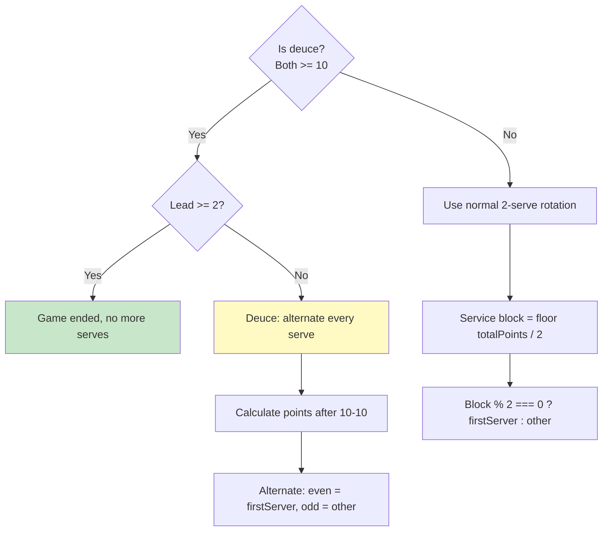
```mermaid
flowchart TD
    CheckDeuce{Is deuce?<br/>Both >= 10} -->|Yes| CheckLead{Lead >= 2?}
    CheckDeuce -->|No| NormalServe[Use normal 2-serve rotation]
    
    CheckLead -->|Yes| GameEnd[Game ended, no more serves]
    CheckLead -->|No| DeuceServe[Deuce: alternate every serve]
    
    DeuceServe --> CalculatePoints[Calculate points after 10-10]
    CalculatePoints --> Alternate[Alternate: even = firstServer, odd = other]
    
    NormalServe --> ServiceBlock[Service block = floor totalPoints / 2]
    ServiceBlock --> BlockRotation[Block % 2 === 0 ? firstServer : other]
    
    style DeuceServe fill:#fff9c4
    style GameEnd fill:#c8e6c9
```

**Recommendation:** Current logic is correct. Deuce continues until 2-point lead. Service alternates every point at deuce.

---

### 7.4 Problem: Preview Buffer Not Affecting Timestamps

**Problem:** Preview buffer adds 0.2s to loop end, but must not change stored timestamps.

**Current Logic:**
- Loop plays from `shotStart` to `nextShotStart + 0.2s`
- But stored `nextShotStart` timestamp remains unchanged

**Edge Cases:**
1. User sees extra 0.2s and thinks timestamp is wrong
2. User wants to adjust timestamp based on what they see in buffer
3. Buffer might show next shot's contact, confusing user

**Solutions:**

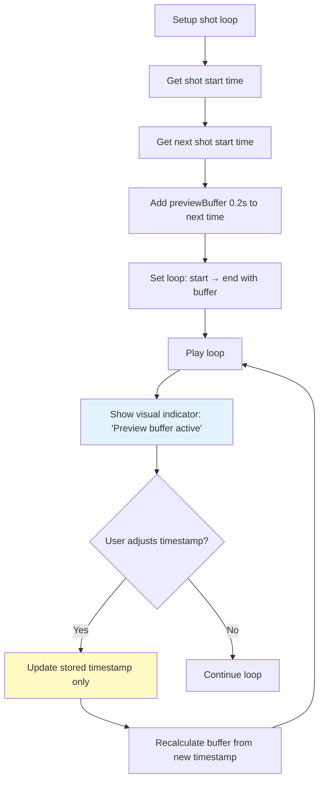
```mermaid
flowchart TD
    SetupLoop[Setup shot loop] --> GetStart[Get shot start time]
    GetStart --> GetNext[Get next shot start time]
    GetNext --> AddBuffer[Add previewBuffer 0.2s to next time]
    AddBuffer --> SetLoopRange[Set loop: start → end with buffer]
    SetLoopRange --> PlayLoop[Play loop]
    PlayLoop --> ShowIndicator[Show visual indicator: 'Preview buffer active']
    ShowIndicator --> UserAdjust{User adjusts timestamp?}
    UserAdjust -->|Yes| UpdateStored[Update stored timestamp only]
    UserAdjust -->|No| ContinueLoop[Continue loop]
    
    UpdateStored --> RecalculateBuffer[Recalculate buffer from new timestamp]
    RecalculateBuffer --> PlayLoop
    
    style ShowIndicator fill:#e3f2fd
    style UpdateStored fill:#fff9c4
```

**Recommendation:** Add visual indicator showing buffer region, and make it clear that buffer is preview-only.

---

### 7.5 Problem: Error Quality Selection Flow

**Problem:** When error quality is selected, landing zone is skipped, but user might want to specify landing zone anyway.

**Current Logic:**
- Error quality → skip landing zone question
- Landing zone is only for in-play shots

**Edge Cases:**
1. User wants to record where error would have landed (for analysis)
2. User accidentally selects error, wants to go back
3. Error quality but user wants to specify landing zone

**Solutions:**

```mermaid
flowchart TD
    SelectQuality[User selects quality] --> CheckError{Is error quality?}
    CheckError -->|No| AskLanding[Ask landing zone question]
    CheckError -->|Yes| ShowSkip[Show: 'Landing zone skipped for errors']
    ShowSkip --> AskConfirm{User wants to specify anyway?}
    AskConfirm -->|Yes| AskLandingOptional[Ask landing zone (optional)]
    AskConfirm -->|No| SkipLanding[Skip landing zone]
    
    AskLanding --> StoreLanding[Store landing zone]
    AskLandingOptional --> StoreLandingOptional[Store landing zone (optional field)]
    SkipLanding --> DeriveLanding[Derive landingType from quality]
    
    StoreLanding --> DeriveLanding2[Derive landingType: inPlay]
    StoreLandingOptional --> DeriveLanding
    DeriveLanding --> Complete[Complete shot tagging]
    DeriveLanding2 --> Complete
    
    style ShowSkip fill:#fff9c4
    style AskLandingOptional fill:#e3f2fd
```

**Recommendation:** Keep current logic (skip landing zone for errors) but allow optional override if user wants to specify.

---

### 7.6 Problem: Undo After Auto-Prune

**Problem:** Undo toast appears after auto-prune, but what if user has already moved to next shot?

**Current Logic:**
- Auto-prune triggers undo toast
- Toast persists 5 seconds
- User can click undo to restore

**Edge Cases:**
1. User moves to next shot before undo expires → undo still valid?
2. User tags next shot, then wants to undo previous prune → complex state
3. Multiple auto-prunes in sequence → which one to undo?

**Solutions:**

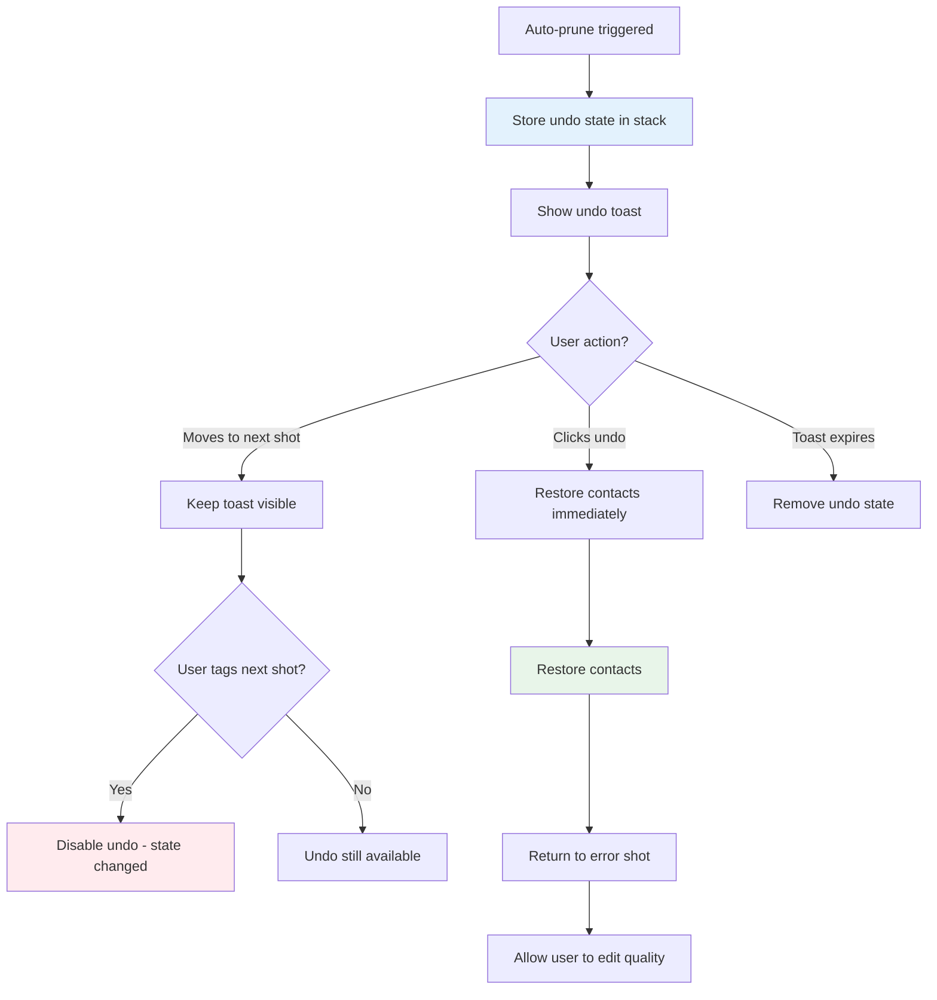
```mermaid
flowchart TD
    AutoPrune[Auto-prune triggered] --> StoreState[Store undo state in stack]
    StoreState --> ShowToast[Show undo toast]
    ShowToast --> CheckAction{User action?}
    
    CheckAction -->|Clicks undo| RestoreNow[Restore contacts immediately]
    CheckAction -->|Moves to next shot| KeepToast[Keep toast visible]
    CheckAction -->|Toast expires| RemoveUndo[Remove undo state]
    
    KeepToast --> CheckNextShot{User tags next shot?}
    CheckNextShot -->|Yes| DisableUndo[Disable undo - state changed]
    CheckNextShot -->|No| RestoreAvailable[Undo still available]
    
    RestoreNow --> RestoreContacts[Restore contacts]
    RestoreContacts --> ReturnToShot[Return to error shot]
    ReturnToShot --> AllowEdit[Allow user to edit quality]
    
    style StoreState fill:#e3f2fd
    style DisableUndo fill:#ffebee
    style RestoreContacts fill:#e8f5e9
```

**Recommendation:** Disable undo if user has progressed beyond the pruned shot. Keep undo stack for multiple prunes.

---

### 7.7 Problem: Match Completion Modal Timing

**Problem:** When should Match Completion Modal appear?

**Current Logic:**
- Appears when user clicks "Complete Part 1"
- User must fill all fields before proceeding

**Edge Cases:**
1. User hasn't tagged all rallies yet
2. User wants to complete Part 1 but match is incomplete
3. User wants to skip completion and come back later

**Solutions:**

```mermaid
flowchart TD
    ClickComplete[User clicks 'Complete Part 1'] --> CheckRallies{Has at least 1 rally?}
    CheckRallies -->|No| ShowError[Show error: 'Tag at least one rally']
    CheckRallies -->|Yes| ShowModal[Show Match Completion Modal]
    
    ShowModal --> FillFields[User fills fields:<br/>- Match result<br/>- Final set score<br/>- Final points score<br/>- Video coverage]
    FillFields --> ValidateFields{All required fields filled?}
    ValidateFields -->|No| ShowValidation[Show validation errors]
    ValidateFields -->|Yes| AllowSubmit[Enable submit button]
    
    ShowValidation --> FillFields
    AllowSubmit --> UserSubmit{User submits?}
    UserSubmit -->|Yes| StoreCompletion[Store completion data]
    UserSubmit -->|No| CancelModal[Cancel - stay in Part 1]
    
    StoreCompletion --> TransitionPart2[Transition to Part 2]
    CancelModal --> ReturnPart1[Return to Part 1 tagging]
    
    style ShowError fill:#ffebee
    style ShowValidation fill:#fff9c4
    style TransitionPart2 fill:#e8f5e9
```

**Recommendation:** Allow "Incomplete" as a valid match result. Don't require all rallies to be tagged.

---

## 8. Summary

### 8.1 Key Decision Points

1. **Error Quality Selection** → Triggers auto-prune, skips landing zone, affects end-of-point derivation
2. **Shot Index** → Determines if forced/unforced question is needed
3. **Last Shot in Rally** → Triggers end-of-point flow
4. **Deuce State** → Changes serve rotation from 2-each to alternate-each

### 8.2 Critical Data Flows

1. **Contact → Shot Data** → Contact stores shot annotation data directly
2. **Quality → Landing Type** → Error qualities derive landing type automatically
3. **Last Shot → End of Point** → Last shot quality determines winner and point end type
4. **Serve Type → Wing** → Serve type automatically derives wing

### 8.3 Validation Rules

1. Cannot end rally without at least 1 contact
2. Cannot mark end of set until rally is complete
3. Cannot proceed to Part 2 without completing Match Completion Modal
4. Cannot skip shots in Part 2 (sequential requirement)
5. Error quality on shot 3+ requires forced/unforced selection

---

*Last updated: 2025-12-01*


